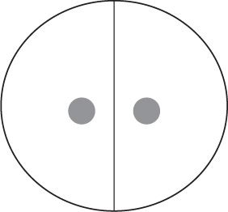

## 1.什么是桌子

当我看着周围的世界时，我发现我被各种各样的东西包围着。我看到一张桌子和两把椅子，建筑物，一架飞机，一盒回形针，钢笔，一只狗，人，以及各种各样的其他种类的东西。但这是一本关于形而上学的书，在形而上学中，我们非常笼统地关注事物的本质。作为一个形而上学者，我很想说，我列出的所有这些东西都是特定的东西，或者群体或种类。特定的概念对我们来说非常重要。我想知道桌子上的笔是我特别的，而不是别人的，或者房间里的女人真的是我的妻子而不是她的同卵双胞胎姐姐。为了理解这些问题的重要性，我们需要更深入地探讨它们。

在我面前放着一张桌子，如果我用指关节敲打它，我可以看到、感觉到和听到。我毫不怀疑它——桌子——存在。但现在我将开始哲学问题。这是什么东西？它存在的本质是什么？桌子是我通过经验知道的，还是我的感官向我揭示了别的东西？毕竟，当我看着它时，我看到了它的颜色：木材的棕色。当我感觉到它时，我感受到了它的坚硬。褐色、硬度、四足度等是桌子的质量或属性。然后有人可能会说，我不知道表本身，而只知道它的属性。这是否意味着桌子是我一无所知的潜在东西？它的特性似乎包裹着它，不可能剥离。

什么适用于表格，也适用于其他特定事物。选择表格作为我的例子并没有什么特别之处。就硬币、汽车、书籍、猫和树木而言，我只有通过了解它们的品质才能了解它们。我看到它们的形状，它们的颜色，我能感觉到它们的质地，闻到它们的香味，等等。事物的这些属性的性质——发红、圆润、硬度、臭味等等——将是下一章的主题。但是，一旦我们提到它们所附的细节，我们真的不能避免提及它们。

### 事物变化越多，它们就越保持不变
现在，我为什么要建议桌子不是我面前可以看到的棕色，硬度和四条腿的东西？一个原因是我可以想象这些属性在表保持不变时发生变化。例如，我可以把桌子涂成白色，因为它更适合我办公室的装饰。如果我这样做，那么它仍然是一张桌子，它只会改变它的外观。有些东西会改变，而有些东西保持不变。

在哲学中，我们看到，如果我们松散地说它是同一张桌子，各种混乱就会占主导地位，所以我们采用了一个重要的区别。我们可以说，即使某些东西在数字上保持不变，它也发生了质的变化。因此，这张桌子的质量可以不同——它是棕色的，现在是白色的——但它仍然是一回事。原来是棕色的桌子现在是白色的桌子。想象一下，如果一个访客走进我的房间，问我的旧棕色桌子发生了什么事。我完全可以接受它仍然在这里：只是他们没有认出它，因为我画了它。尽管质量发生了这样的变化，但成为同一人就是我们所说的数字相同性（变化的主题将在第4章中详细探讨）。

正是这种考虑使我认为表本身不能与其属性相同。至少其中一些可以改变，但它仍然是同一张桌子。因此，当我观察和感受表的属性时，我只是在观察它的属性，而不是表本身。但是，如果表不是它的属性，那么它是什么？

这里有一个建议。表是属性的基础，并将它们全部保存在一个地方。它是我看不见或摸不到的东西，因为我所经历的只是事物的属性，但我知道它通过我的理性思考而存在。例如，当我在房间内移动桌子时，它的所有属性都会随之移动。它们以半永久性的方式聚集在一起。桌子的褐色和硬度不是可以移动，而是四条腿可以留下。不过，我说这些属性只是半永久地聚集在一起。正如我们所看到的，一些属性可以从集群中剥离出来，而新的属性取而代之，所以我们不能绝对严格地说这些属性是不可分割地绑定在一起的。褐色可以脱落并被白色取代。

这种对细节的看法可以通过用于将销钉固定在一个地方的销垫的比喻来最好地理解。图钉代表对象的属性，垫子代表特定本身。有人称之为细节的底层视图，其中针垫是支撑所有视图的底层。一个别针代表桌子的棕色度，另一个代表它的硬度，第三个别针代表它的重量，另一个代表它的高度，依此类推，代表桌子的每一个属性。如果我们能通过一个抽象的过程，在精神上剥离它们，我们就会明白，事物本身与它们是分开的，并且是它们都存在于其中的东西。当然，当您从真正的针垫上取下所有销钉时，您仍然会留下一些可以看到和触摸的东西。但请记住，我们的隐喻针垫，当它的所有针都被移除时，是一个被剥夺了所有属性的特殊，以便我们可以想到桌子本身是什么。因此，如果没有属性，它看起来或感觉都不像任何东西。

例如，考虑一只猫。我们可以想到它没有它的黑暗;因为这是一个属性，我们想知道它所有属性的基础是什么。但去除它的黑色并不像剥猫皮。除了去除它的颜色，我们还必须去除它的形状，因为这只是其他属性的另一个属性，它的四足、臭味和毛茸茸的味道也是如此。把所有这些拿走，我们很可能会想知道这个底层到底是什么。它必须是看不见的。它没有长度、宽度或高度，也没有颜色或坚固性。它可能会有一种光秃秃的，可能真的让我们开始怀疑我们是否拥有任何东西。

哲学家因计算出一个想法的所有含义而臭名昭著。但他们不一定总是接受这些暗示。有时，一个后果是如此荒谬，以至于它可以被视为拒绝最初假设的充分理由。这种违反直觉的后果将使它产生的假设沦为荒谬。也许我们可以说这种情况发生了。有人建议，特定必须是其属性以外的其他东西。但是一旦我们开始从猫本身中抽象出猫的属性，我们意识到它几乎不会留下任何东西。我们的底层猫似乎什么都不是。它没有重量，没有颜色，没有空间延伸，等等。这开始看起来像是一件无关紧要的事情。不是所有存在的东西都有属性吗？并不是说“裸露”的细节可能存在，其中一些只是幸运地意外获得了财产。当然，每一个曾经存在和将要存在的物质事物都有某种形状、重量或特征。说好像这个东西可以以某种方式独立于这些属性而存在，这也许是导致我们荒谬的错误。

### 属性捆绑包
在这种情况下，让我们考虑一种不同的方法。如果不可能有“裸露”的细节，没有属性而存在，那么我们可能需要再次考虑我们开始的集群或属性捆绑。当我们在头脑中剥离这些属性时，在一个抽象的过程中，我们担心的是，我们什么都没有。那么，我们难道不应该支持这样一种可能性，即除了那一堆属性之外，没有任何东西可以呢？如果一旦删除了所有属性，就真的没有余数，那么我们知道我们的属性不能超过它们。捆绑视图是，细节只能根据属性来考虑。这种观点的可信度如何？

有几个与之相关的问题，这些问题来自我们已经讨论过的变革问题。如果一个事物只是属性的集合，它就无法在任何变化中幸存下来。如果一个财产丢失而另一个财产获得，我们将有一个不同的集合：因为我假设使一个集合在不同时间成为相同事物的原因是它由相同的组件组成。因此，如果两个集合中收集的东西不同，则它们是不同的。显然，我们感兴趣的细节一直在变化，同时（在数字上）保持不变。猫经常改变形状。有时它是平躺的，有时它被卷成一个球，然后它可能跑来跑去，不断改变它的形状。当猫一直在变化时，它们怎么可能只是属性的集合？

不过，也许可以回答这个反对意见。也许我们应该把一个东西看作是一系列属性的捆绑，由一定程度的连续性联合起来。因此，虽然桌子可以改变并涂成白色，但它保持大致相同的重量、高度和物理位置。我假设物体的物理位置是它的属性之一，显然在这种情况下，这是一个非常重要的位置。我相信白色桌子与以前的棕色桌子是一回事，因为我在同一个房间里找到了它。如果它已经移动，我希望它通过从它开始的地方到结束的地方之间的一系列位置来逐渐移动。虽然猫的形状变化很快，但它保持相同的颜色、毛茸茸、气味，重要的是，它在同一个地方;或者，如果它改变了位置，它已经通过一系列地点这样做了。因此，我们可以说，当属性的捆绑来来去去时，特定的东西是这样的捆绑的连续性，具有适当的连续性贯穿始终。

还有许多其他困难需要面对，但在继续考虑其中一个之前，值得一提的是这个捆绑视图的一大优势。我们考虑的第一个账户是，细节是将事物的属性结合在一起的潜在底层。为了解释特定的物体，如桌子、椅子、狗和树，我们有两种成分。我们有一个东西的属性和它的底层。但是有了这个新的捆绑理论，我们似乎只需要一种东西。我们只有属性，当它们出现在这样的捆绑包或连续序列中时，我们说我们因此有一个特定的对象。因此，我们以前需要两个元素的地方，现在只有一个。看待这个问题的另一种方式是说，底层的概念在其他方面已经完全被简化。对象只不过是适当排列的属性捆绑包。

因此，第二种理论更简单，因为它调用的实体种类较少。不可知的无形底层似乎没有给我们带来任何额外的东西：如果束理论是正确的，那么底层就是可有可无的。现在没有特别的理由说明为什么一个更简单、更经济的理论比一个复杂和不经济的理论更有可能是正确的，但哲学家们更喜欢简单的理论。当然，似乎没有理由容忍一个人的世界理论中的冗余，因为任何多余的元素显然都不需要，账户就可以发挥作用。它们没有任何用处。

### 双胞胎
因此，丛理论看起来比底层观点更简单。但它是不是太简单了？它是否有足够的资源来提供我们想要的某件事？有一个考虑表明不是。这个理论告诉我们，一个特定的只是属性的集合。例如，斯诺克球只是一束红色、球形、闪亮、直径 52.5 毫米等属性。然而，该理论的问题在于，可能存在另一个具有这些属性的对象。事实上，为了让斯诺克比赛公平，应该有很多具有相同属性的红球：它们是标准化的。然而，该理论在这里存在困难。它告诉我们，一个特定的只是捆绑包。但是，如果我们有相同的捆绑包，则意味着我们有相同的对象。换句话说，根据这个理论，不可能有多个对象是同一组属性。

可以说，这种反对意见仅仅是技术问题，并不重要。难道不是，事实上，两个不同的对象从来没有真正共享所有相同的属性吗？即使是批量生产的桌子，在重量、颜色上也会有一些非常细微的差异，甚至只是表面上细小的、微小的划痕图案。我们的斯诺克球只需要在它们的属性上足够接近，游戏就可以公平地玩，所以它们也可以有一些细微的差异。然而，这种回答忽略了哲学理论的重点。这应该是对特定事物的解释。这个理论的真理不应该依赖于运气，这样每件特定的事情恰好都是一个不同的捆绑。似乎至少有一种可能性，即两个东西可以共享它们的所有属性。如果像理论所说的那样，细节只是属性的束，那么它就与这种可能性不一致。具有相同属性的两个细节折叠为一个。

对于捆绑理论家来说，有两种可能的出路，但两者都有问题。第一个明显的解决方案是说，原则上有两个细节不能共享其所有属性是有原因的。如果允许关系属性，那么这些属性可以说一定不同，因为它们允许时空位置进入等式。下面的示例阐释关系属性的含义。即使所有的红色斯诺克球在检查时都无法区分，也许其中一个距离斯诺克桌的右下口袋只有 20 厘米，而另一个距离它 30 厘米。一个球具有距离口袋 20 厘米的关系属性，而另一个球具有距离同一口袋 30 厘米的关系属性。假设没有两个完全不同的细节可以同时占据同一个空间，那么似乎所有事物都将具有一组独特的关系属性。

这是这个提案的问题。不能保证不同的事物真的会有不同的关系属性，除非我们重新将细节引入我们的形而上学。这就是原因。我们应该把空间（和时间）中的位置看作是绝对的还是相对的？如果它是绝对的，那就表明空间位置存在某种特殊性。一个职位将是一个特殊的。一个特定的概念——一个没有被定义为一束品质的概念——将回到理论中。这不好，因为我们希望消除属性捆绑方面的细节。

那么，我们是否应该定义彼此之间的空间位置呢？这样做的问题在于，至少宇宙的空间有可能有一条对称线;因此，位于对称线两侧的相应位置的位置将与整个空间中的所有其他地方具有相同的关系。如果我们把两个斯诺克球放在我们对称宇宙中的那些对应点上，那么理论上仍然有可能，两个不同的细节在它们的所有非关系和关系属性上都是相同的。（这听起来有点复杂，但图 1 显示了其含义。在捆绑理论中，它们再次相互坍缩。

这是一个复杂的论点。简短的摘要可能会有所帮助。我们试图根据它们具有不同位置来区分无法区分的细节。但是，要么这些位置本身就是细节，在这种情况下，我们没有成功地消除细节，要么位置只是通过它们之间的关系来区分。在后一种情况下，对称结构的可能性意味着我们可以有两个即使基于位置也无法区分的细节。

图1： 对称的宇宙

我们刚刚提出的是丛理论家提出的第一种方法，以避免具有所有相同属性的细节折叠成一个的暗示。由于这似乎不起作用，这是第二个建议。反对意见认为，理论包含具有所有相同性质的丛必须是相同的，只有当这些性质以某种方式被理解时才会成立：因为没有什么像细节一样。但是还有其他概念，正如我们将在第2章中看到的。也许这些属性以某种方式被特殊化。因此，此捆绑包中的红色可能与另一个捆绑包中的红色不同。然后，可能存在具有所有相同属性的不同细节。它们由相同类型的属性组成，但由不同的实例组成。这不就是我们对所有红色斯诺克球的看法吗？这个球的红色与那个球的红色不同。它们是红色的两个不同实例。

但是这个明显的解决方案又存在问题。我们保存了捆绑理论，但付出了代价。据指出，捆绑理论的一个优点是，它完全从属性的角度考虑了细节。在属性方面，特殊性被削弱了。但现在看来，我们能够从反对意见中挽救丛理论，即只有当我们以某种方式将属性理解为细节时，两个相同的丛才会坍缩成一个。我们谈到有两个不同的红色实例，一个属性实例看起来像某种特定的实例。因此，为了使我们的捆绑包的行为更像我们获取对象的细节，我们必须使我们的属性像细节。特殊性已经设法潜回了理论。

一路走来，我们可能犯了无数的错误。但是，我们似乎不得不得出结论，特殊性是现实的一个不可简化的特征，因为理论上可能存在两个不同的细节，其独特性并不在于它们具有不同的属性。

那么，什么是桌子呢？经过本章的考虑，我们似乎不得不说它是一个具有某些属性的特定，但与这些属性不相同，也不能简化为这些属性。该表被任意选择为我们检查的对象，因此从中概括似乎是安全的。然后，我们应该对任何其他对象给出相同的答案。

本章通篇都提到了细节的性质。我们接下来需要考虑这些东西应该是什么，如果它们确实是东西的话。因此，我们继续讨论这个话题。