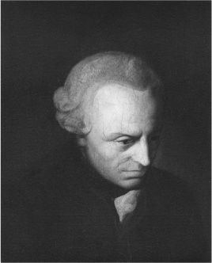

## 10.什么是形而上学
现在我们已经看了形而上学中讨论的一些主要问题，我们处于一个更明智的位置来回答形而上学是什么的问题。形而上学是我们在前九章中一直在做的活动。参与其中后，我们就能更好地理解它。

许多问题听起来很简单、愚蠢或幼稚，而且经常被驳回。一旦我们长大了，我们就不应该问圆是什么，时间是否流逝，或者什么都没有。就好像我们生来的自然惊奇感是从我们身上自律出来的。

也许形而上学被认为是无用的浪费时间，或者更糟糕的是，是一种危险的分心。我们不应该忘记苏格拉底因为如此烦人而被处死的故事（可能只有一半是真的）。然而，读者将看到，这些非常简单的问题可能导致复杂的答案。仅仅从询问什么是圆开始，我们很快就进入了一些关于世界本质、现实和存在什么的深刻问题。思考这些问题可能有助于发展我们的思维。我们不得不非常努力地思考并表演一些心理杂技。但形而上学还有比这更有用的吗？也许我们已经获得了理解，但看起来我们把这种理解说不上来是没有用的。毫无意义的指控似乎成立。

那么，在过去的九章中，我们做了什么呢？一个答案是，我们一直在努力理解现实的基本本质。但这只是我们感兴趣的现实的一个方面，我们寻求的只是一种理解。科学也试图理解现实的本质，但它以不同的方式进行。科学寻找一些普遍的真理，但它们也是具体的，而形而上学的真理是非常普遍和抽象的。

当我们考虑存在的东西时，哲学家的答案将是最高层次的普遍性。他们可能会说，有些细节属于自然种类，有性质，变化，原因，自然规律等等。然而，科学的工作是说明每个类别下存在哪些具体的东西。例如，有电子，或老虎，或化学元素。有自旋、电荷和质量的性质，有溶解等过程，有引力定律等自然定律。

形而上学试图组织和系统化科学发现的所有这些特定真理，并描述它们的一般特征。虽然，在解释形而上学时，我试图用大量的例子来说明，但读者也会看到这种选择有些武断。我问什么是圆，什么是桌子。我也可以问什么是发红或什么是分子。这些只是进入一般财产问题和一般细节问题的方式。

### 物理学和形而上学
形而上学和科学在普遍性水平上存在差异，但在方法上也存在差异。尽管这些学科的主题与其重点相同 - 世界的本质 - 但他们试图从不同的方向理解它。科学以观察为基础，观察往往是它的起点，也是理论真理的最终仲裁者。形而上学虽然关注世界，但并不那么关心世界可以观察到的那部分。我们用眼睛看到的东西在形而上学或一般的哲学中几乎没有帮助。感官的证据并不是决定哲学理论是被接受还是拒绝的因素。

例如，我们考虑了表格是否只是一堆属性，还是将所有这些属性结合在一起的基础物质。我们应该注意到，我们不能根据观察在这两种理论之间做出决定。无论其中哪一个是真的，世界看起来都是一样的。这并不是说我们实际上可以去除真实物体的属性并找到一个没有属性的底层。考虑到它是无产的，会是什么样子？因此，我们的问题不是科学问题。学生在开始形而上学时经常遇到的一个困难是他们无法将其与科学，尤其是物理学区分开来。他们认为，如果世界是我们的主题，那么我们应该以科学的方式看待世界。我们可以用它来举例来让我们开始，但我们不能指望它回答我们的形而上学问题。

我们的学科得名可能是一个历史事故。形而上学是亚里士多德继物理学之后的书。但是，无论有意与否，还有另一种查看名称的方法可以很好地描述活动。元可以解释为“高于”或“超越”的意思，我们在形而上学中所做的确实是超越物理学的。它的普遍性高于其水平;它超越了对世界的观察调查，思考世界应该或可能具有的理性特征。在这种情况下，这门学科确实有一个非常合适的名称，因为亚里士多德书中讨论的问题正是这种性质的。然而，同样可以得出的结论是，称形而上学的实践者为形而上学的实践者是错误的。医生是行医的人。我们的主题并不超越医学。物理学的实践者就是物理学家，因此做形而上学的人就是形而上学者。

然而，形而上学受到挑战不仅仅是因为它幼稚或烦人。当我们承认它是非经验的——它不是关于我们的感官可以观察到什么——那么就会有许多怀疑论者愿意攻击它。如果形而上学是关于无法观察到的东西，那么我们如何了解它并回答它的问题呢？我们怎么知道这不全是空话或纯粹的废话？休谟和那些追随他的人基于这些理由驳斥了形而上学。经验主义哲学家说，我们的思想必须源于我们的经验才能有任何意义。如果形而上学中使用的术语不能追溯到某种原始观察，那么它们实际上毫无意义。正因为如此，休谟建议将形而上学置于火焰之中。他不认为自己是一个形而上学的学者，尽管他影响了后来的许多辩论。很少有人遵循他烧书的建议，但休谟的批评经常以更现代的伪装重新出现，例如逻辑实证主义。

对休谟的一个回应是康德在他的《纯粹理性批判》（1781）中的形而上学版本。这被描述为对形而上学的辩护，但也有可能将康德解释为在某种程度上降低了该主题的野心。康德学者在如何最好地理解他方面存在分歧，但一种方法是将他的形而上学视为我们对世界思维结构的描述，而不是关于世界本身。由于我们的思维和经验的局限性，我们必须以某种方式理解它。带着这个想法，人们可能会说，我们必须从细节及其属性的角度来思考世界，或者位于时间和空间中，或者涉及原因。或者有人可能会说，形而上学只是关于我们用来描述世界的概念以及它们如何相互关联。也许这种形而上学更容易辩护，但必须承认，它从根本上改变了它的本质。形而上学者想要发现世界是什么样的，而不是关于我们的概念，或者关于我们的心理学的事实，或者只是关于我们的心理学所容纳的世界的一部分。康德自己的立场是否值得这种回应，我不敢评论。然而，要指出的是，当形而上学受到攻击时，很容易撤退到一些更容易防御的地方。然而，在这样做的过程中，可能不再是形而上学在捍卫。

我们能否以纯粹的原始形式描述形而上学的实践，并捍卫它免受无意义、无用和毫无意义的攻击？读者可能会考虑，他们在过去九章中遇到的问题是否毫无意义。也许你和我有同样的直觉。

图11. 伊曼纽尔·康德（1724-1804）

虽然它们没有通过观察来解决，但仍然可以说它们是真实而有意义的问题。我们也可以争辩说，它们是关于世界的本质，而不仅仅是概念或我们的思维方式。让我们看看我们是否可以捍卫这一观点。

### 眼见为实？
首先，让我们承认观察的力量被大大夸大了。虽然科学家可能会使用他们的感官，但观察并不能解决一切问题。我们对科学的信仰在很大程度上是理论性的。在这种情况下，也许形而上学与科学是连续的。形而上学家所做的与其他想要理解世界的人所做的并没有什么古怪的不同。形而上学处于更抽象和理论的一端，但它看起来更像是一个滑动尺度，而不是两个学科之间有一个非常尖锐的界限。

在形而上学中，我们用我们的思想，我们的推理，作为我们关于世界可能如何或应该如何的指南。我们可以拒绝对世界某些特征的描述，如果它们是荒谬的，要么是违反直觉的，要么是完全矛盾的。后者更可取。一个理论可能意味着世界是某种方式，但也不是那样，在这种情况下，我们有理由拒绝这个理论，因为它是不连贯的。然而，事情如此清晰可能很少见。即使他们是，理论的捍卫者也可能会试图解释矛盾。更常见的是，我们会质疑一个理论说或包含一些难以置信的事情。例如，如果有人说时间在流动，那么似乎应该能够说明它流动的速度。但我们看到，这无法得到有意义的回答：它必须以每秒一秒的速度流动。我们还考虑了缺勤可能是原因的理论，但这也产生了荒谬的后果。我们必须允许，一个没有任何东西可以具有因果关系，正如我们所看到的，任何事件的原因中，都没有任何东西可以阻止它。

当一个后果如此违反直觉时，我们说我们已经把理论简化为荒谬。就实质而言，我们似乎已经将特定是一堆属性的理论简化为荒谬。在这个理论中，不可能有两个具有相同性质的细节，我们似乎没有充分的理由来接受这一点。当然，也有哲学家认为该理论可以避免这种荒谬的还原，因此它永远不会是事情的绝对结局。其他人可能会否认这样的后果确实是荒谬的。我们也不应该假设事情的真相总是直观的。我们有时不得不遵循论点并接受它所带来的一切，即使它令人惊讶。因此，总有进一步哲学辩论的余地。

这里没有什么真正取决于感官的使用。当然，你需要成为一个思考者才能开始哲学，而体验世界似乎是其中的先决条件。你的感官可能也向你表明，特殊性是世界的一个特征，需要解释。看起来有特别的事情。但在那之后，这取决于你抽象地思考一个特定的必须是什么，或者一个原因，或者一个时间。您可以根据需要尽可能全面地探索各种理论。其中一些经不起推敲。

暂时地，我们可以拒绝一些理论，如果它们看起来有一个棘手的问题：如果它们似乎涉及矛盾或其他荒谬。我们承认，这个问题可能在将来的某个时候得到解决。到目前为止，形而上学家所做的似乎与一些最聪明的科学家所做的并没有太大不同。理论物理学家可能会以类似的理由拒绝理论。有一个区别。形而上学者仅根据推理来拒绝理论：理论的问题是与我们珍视的其他一些理论的内在一致性或矛盾。就科学而言，作为拒绝理论基础的冲突可能与一些观察证据有关。科学希望理论符合观察事实，而形而上学的数据是非观察性的。

到目前为止，这看起来是可以辩护的。形而上学看起来并不比科学更站得住脚。但是，有人可能会争辩说，这是因为我们只看了理论被拒绝的负面情况。当然，如果一个理论是自相矛盾的或导致荒谬的，无论是在科学还是哲学中，都应该被拒绝。但这只会让我们有理由排除理论，而不是接受理论。在这里，人们可能认为科学占了上风，因为它可以找到对其理论的经验证实。在哲学中，可以想象并且很可能是关于某个问题的连贯理论不止一个。多个理论可以单独为真，即使它们不能同时全部为真。那么我们如何确定哪一个是正确的呢？也许形而上学没有真理，只有一堆我们无法选择的理论。

这再次忽视了我们在哲学和科学中的思维方式。正如我们从科学哲学中知道的那样，仅仅通过观察就说我们知道哪个世界理论是正确的是有问题的。这样做可能会提供有用的数据，排除一些理论，但不止一个理论可能与数据一致。那么，我们如何确定哪种理论是正确的呢？我们怎么知道任何事情都是真的？这不是一个容易回答的问题。有些观察甚至可能部分由我们相信的理论决定，因此在科学案例中，这远非一件简单的事情。形而上学中的真理也是艰苦的工作，但关键是，我们不应该对形而上学中的真理施加任何比其他情况下更严格的标准。然后我们可能会发现，我们的理论是暂时的，容易出错的。我们同意，可能必须对它们进行修订，但是，与它们合作可能是合理的。

形而上学和科学之间的关系可能比刚才讲的故事要复杂得多。我们经常喜欢两者的一致性，即使它们不是完全冲突。理想情况下，我们想要一个适合科学所描述的世界的形而上学，以及形而上学合理的科学。我们已经看到一个案例来说明这一点。在第6章中提出了关于同时性的问题：这个概念受到科学中相对论的挑战。相对论并不反驳某些关于绝对空间和时间的哲学解释，它是可以维持的。但是，我们可能仍然认为，最好是发展一种形而上学来描述世界的方式，正如现有最好的科学理论所描述的那样。然后，我们可能实现的是一种科学知情的形而上学。这也许会让我们对在具体和抽象层面上运作的世界有一个连贯的描述。

### 理论美德
在形而上学中，在决定持有哪种账户时，我们必须寻找一系列理论美德。我们看看这个理论能解释多少真正重要的东西。它是否与我们的其他理论相结合，以提供对世界的统一描述？它是否用很少的东西解释了很多，或者我们假设太多来启动理论，以至于它的解释力是一种幻觉？

例如，还有许多其他世界的理论被推荐，因为它解释了这么多。例如，它告诉我们什么是可能的。然而，正如我们所看到的，为了使理论开始，我们必须假设在某个现实世界中存在每种可能性。在这种情况下，看起来我们只是从理论中得到解释，我们作为假设投入其中的东西。因此，我们经常在执行一种平衡行为，将假设的数量与解释能力进行比较，就像某种宇宙成本效益分析一样。

同样，当我们将形而上学与在科学中寻找知识进行比较时，它似乎并没有天壤之别。我们希望找到以相对简单的方式解释现象的理论，不需要古怪的假设或临时假设。对于科学来说，要解释的现象可以包括观测现象，例如粒子的意外存在或行星的运动。这样的运动必须由理论所包含，才能算作它的解释性成功。

在形而上学中，现象不是以同样的方式观察的。我们承认必须解释一些非常抽象的事情：例如，似乎存在多个细节，因果关系似乎是世界的一个特征。如何最好地解释这些一般特征？一旦我们解释了我们的世界因果关系必须是什么样子，我们就会把它留给科学来告诉我们是什么导致了什么。我们只想知道一件事导致另一件事是什么。我们采用与其他人相同的理论美德。我们希望发现对世界某些特征的最佳解释。只是形而上学者感兴趣的特征是抽象的，而且非常笼统。它们不能像观察桌子或猫那样被观察，但也许它们是从我们观察到的东西中抽象出来的。我们从这些事情中产生了特殊性的概念，这就是我们想要解释的。

### 形而上学的价值
我们的批评者似乎有一个我们无法回答的论点。我们可能有理由暂时拒绝某些理论并接受其他理论，在这方面，我们可能没有冒犯其他人会采用的理性原则，但形而上学的纯粹无用表明我们为什么不应该这样做。因为科学至少与我们观察和互动的经验世界有某种联系，所以我们可以利用我们的科学理论来得到我们想要的东西。科学可以得到有益的应用。我们可以操纵世界，利用科学达到自己的目的。好的科学产生好的结果。因为形而上学是如此的理论化，如此抽象，如此的非经验性，似乎根本没有回报。它不允许我们操纵我们周围的世界。它实际上是无用的。

我们不必害怕这种论点。首先，它的基础是有争议的。例如，因果关系对一切都很重要。我们对世界的操纵取决于因果关系。没有它，一切都没有意义。事实证明，我们无法知道是什么导致了什么，除非我们有一些理论 - 一个不可避免的形而上学理论 - 关于某物导致其他事物是什么。例如，哲学上的误解可能导致实际错误，如果我们假设因果关系只不过是相关性。

但假设论证的基础是正确的。假设形而上学真的是一无是处。这是否意味着它一文不值？不。许多东西的价值是有用的：它们能给你带来你想要的其他东西。但有些东西具有内在价值。它们的价值只是因为它们本身就是如此。即使形而上学是无用的，但它的见解也可能如此深刻，以至于它可能对我们具有最高的内在价值。它将使我们对现实的本质有一个无用但深刻的理解。事实上，柏拉图的想法是有道理的。

对世界是什么，它如何运作，以及它如何组合在一起的形而上学理解，无论是一般的还是抽象的，可能是最真实和最重要的事情。在这种情况下，我们做形而上学不是为了保持健康和富裕：我们想保持健康和富裕，这样我们才能做形而上学。