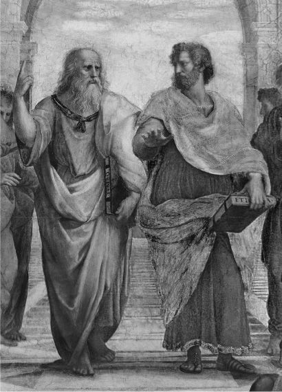

## 2.什么是圆

本章的开篇问题问起来很简单。什么是圆？你会认为，在人类文明的所有世纪中，我们现在应该已经回答了这个问题。并且至少有一个非常清晰和简单的答案，这是由几何学提供的。数学家对圆有一个精确的定义。但我们现在应该把这个定义放在一边，因为它不是我们感兴趣的答案类型。

我们周围有各种各样的圆形物体：硬币，轮子，球的周长，杯子的边缘，一张纸上的线条图。这里有各种各样的个人圈子，出现在不同的地点和时间。所有实例似乎都有一个共同点。它们的共同点和清单上的其他东西就是我们所说的循环性。我们给这个特征起一个名字，并把它当作一种实体来对待。相同的功能可以在许多不同的地方和对象中找到。有些人说循环性是贯穿多的。在所有这些不同的细节中，可以找到一个循环性。

### 兜圈子
这个循环的东西似乎有些奇怪，如果它真的是一回事的话。通常，当人们想到事物时，它们是物体：特定的物体，如桌子，椅子，汽车，建筑物，树木，钢笔等等。随机选择这样的东西：一支特定的笔。这支笔可能放在特定房屋的特定桌子上。它将有一个存在的开端和一个特殊的历史。现在，如果这支笔放在特定的桌子上，我们知道它不在其他地方。如果某个人拥有这支笔，我们知道没有其他人拥有。当然，一群人可以合伙购买一支笔，但同样，如果该合伙企业拥有钢笔，那么其他人就没有了。合作伙伴可能每人拥有一支笔的一小部分。

因此，绵羊、桌子和围栏都是特定的对象。我们也可以说一个圆，好像它是一个特定的东西。但循环性具有非常不同的性质。与笔的情况不同，圆形出现在一个地方或时间的事实并不能阻止它出现在其他地方和时间。在它出现的所有那些地方，它完全存在。这与笔的情况不同。它被一个人完全拥有，阻止它被另一个人拥有，而一件事是循环的，并不能阻止其他事物是循环的。当笔是共同拥有的时，每个所有者只拥有笔的一部分。但是，如果许多事物是循环的，那么每个事物都是完全循环的。并不是说循环性必须分部分分享，例如，如果恰好有两个东西，那么每个东西都是半循环的。那将是荒谬的，因为那样的话，这些东西终究都不是循环的。这就是说循环性在其所有情况下完全存在的意思，它是贯穿许多其他事物的一件事。

这似乎是一个令人困惑的纠结，所以让我们试着把事情理顺。一种观点认为，实体有两种基本类型：细节及其属性。桌子、椅子和羊是细节的例子，它们似乎一次只出现在一个位置。循环性是属性的一个例子：特定特征或质量。一个属性整体出现在一个地方的事实，对它在其他地方和时间出现在其他地方没有限制。由于这个特性，有些人喜欢称属性为通用性 - 它们可以在任何地点或时间 - 尽管实际上这个术语最适合用于属性是什么的特定理论。其他属性示例包括发红、方形、毛茸茸、可溶、易爆、高大等。

### 相关事项
关于这些属性，在形而上学上有很多话要说：关于它们的本质和存在。但首先，应该指出的是，通常区分属性和关系，在关系的情况下发现了许多相同的问题。

艾伦比他的大儿子鲍比高。我们可以认为这比艾伦与鲍比的关系更高。还有许多其他高于的地方。鲍比比他的妹妹克拉丽莎高，克拉丽莎又比她的狗道格尔高。帝国大厦比克莱斯勒大厦高。同样，可以说，这种高于它的关系完全存在于其每个实例中。也许比在房产的情况下更是如此，很明显，在艾伦比鲍比高和鲍比比克拉丽莎高的情况下，似乎出现了同样的事情。当我们说一件事比另一件事高时，似乎在每种情况下我们的意思都是一样的。

现在让我们回到属性的案例，因为我们在这里拥有了我们所需要的一切，可以继续讨论一些真正深刻的哲学问题。假设有人要收集世界上每一个圆形的东西，或者每一个红色的东西，或者每一个一百面的东西。毫无疑问，这实际上是不可能的，但作为思想实验，它值得娱乐。假设他们当时要粉碎所有圆形的东西，或者不管是什么例子，直到它们被摧毁或至少不再是圆形的。他们会因此破坏循环吗？可以说不是。充其量，他们已经摧毁了它的所有实例。但是，我们能说循环性仍然存在吗？如果是这样，它存在于何时何地？

### 柏拉图的天堂
柏拉图，最伟大的哲学家之一，对此有一个答案。起初，这听起来太异想天开了，但反思可能会消除这种感觉。形而上学经常是这样工作的。柏拉图不认为你可以破坏循环性。他认为我们所熟悉的实例都是真正循环性的不完美复制品。物理世界中存在的每一个循环事物在其循环性上都会有缺陷，至少在某种程度上，无论多么小。圆的几何定义在这里是相关的。柏拉图认为只有数学家才真正熟悉一个完美的圆，其中圆周上的每个点与中心的距离完全相同。但是我们在周围世界看到的所有圆都会与这个完美或理想的圆有轻微的偏差。现在这是幻想的部分。柏拉图认为，完美的圆存在于一个天堂般的、超然的世界里：超越我们居住的日常物品的物质世界。这个天界也将包含所有属性和关系的所有真实版本。

在这一点上，我们需要暂停一下，因为所谓的柏拉图王国的存在，其中诸如圆形，红色，毛茸茸以及诸如高于存在的关系之类的属性非常惊人。这个境界不是我们用眼睛看到的，也不是我们身体上能与之互动的。根据柏拉图的说法，它必须通过纯粹的智力来思考和理解。这个想法吸引着这样一种想法，即世界比我们人类创造的要多。

例如，考虑 2 + 2 = 4 的事实。即使没有人想过，或者即使人类从未存在过，这难道不是真的吗？假设宇宙是贫瘠的，只充满了没有生命的岩石。2 + 2 块石头仍然等于 4 块岩石，即使没有人会想到它或表达它。在这种情况下，柏拉图主义应该有一些吸引力，因为对于我们的世俗和日常世界和思想来说，有些事情似乎太伟大了，太完美了。

柏拉图主义是一种非常强烈的关于属性的现实主义形式。对于柏拉图来说，它们比我们通常遇到的不完美的副本更真实。只有柏拉图式的圆是一个完美的圆。其余的都是有缺陷的。他称这些完美版本的属性为形式，他认为它们是所有属性中最真实的东西。我们知道它们仅通过我们的智力掌握而存在，所以我们不必担心我们的感官是否会误导我们。

不是每个人都喜欢柏拉图主义的想法。这可能不仅仅是个人喜好的问题。柏拉图主义者将存在分为两个领域：我们居住的领域和属性存在的天堂领域。但是，每当我们将某些东西分为两个领域时，我们必须讲述一个关于它们如何联系的故事，这通常会变得复杂。这个问题困扰着这个帐户。圆的完美形式和我们周围看到的单个圆之间应该是什么关系？柏拉图多次试图回答这个问题，但没有完全成功。一个圆存在于天界，在空间和时间之外。其他圆在空间和时间上都存在得不完美。那么它们怎么可能与表格联系起来呢？当它们的本质如此不同时，它们能像柏拉图式的圈子一样吗？

任何此类建议都存在重大困难。假设我们想这样说：世俗的圆圈类似于圆的完美形式。相似是一种关系。但是，人们会记得，一种关系也是柏拉图主义者认为属于他们天国的东西。因此，会有一种相似的形式。然后，我们将不得不再次回答同样的问题：相似的形式与实际的相似性（在世俗的圆圈和圆的形式之间）有什么关系？如果我们给出同样的答案——它与它相似——我们将不会取得进一步的进展。我们将开始哲学家所说的无限倒退。将会有一系列永无止境的相似之处，这表明最初的答案是不好的：我们永远不应该试图说这些实例与表单有关。

然而，柏拉图主义并不是我们唯一的选择，所以如果我们认为这个理论看起来注定要失败，我们就不必绝望。还有另外两个主要选项。第一种是对属性的反现实主义，当然被认为是普遍的。这需要解释。

出发点是一个假设，即世界上有两种基本的东西：细节和属性。但并不是每个人都接受这一点。拒绝一分为二的一个原因恰恰是，它们需要以某种方式结合在一起。我们必须把圆和绿作为属性，与世界上的物理事物（如苹果）结合在一起。但那时我们必须开始谈论苹果实例化这两个属性，或者一些这样的帐户。相反，假设我们说只有一种东西。如果我们说世界上的一切都是特殊的呢？（这与第1章中考虑的细节的捆绑理论相反，后者说一切都是一个属性。

这种仅凭细节的观点很有吸引力。我知道桌子和椅子是存在的，球和螺旋盖罐子，树，铅笔，硬币和各种各样的东西。但我不太确定循环性是一种以与硬币相同的方式存在的东西。当早些时候提出循环性的理由时，它需要一些工作来使其听起来合理。但可以肯定的是，根本不需要任何工作来说服某人所有这些不同的细节都是真实的。

### 一切都只是文字
那么，对于所谓的属性，我们怎么说呢？认为一切都是特定的观点有时被称为唯名论，意思是名称主义。这个想法是，循环性只是一个名称 - 只是一个词 - 我们用来描述特定对象组。这个理论有很多种，但一个是这个名称适用于彼此相似的一组细节。因此，有一些细节——一个球、一枚硬币、一个螺旋盖、一个轮子等等——而圆形只是这些东西彼此相似的方式的名称。循环性本身不是东西。它没有存在或实相。每一件事都是特别的。

但唯名论有其自身的问题。可以询问这组对象彼此相似的方式。假设作为例子提供的一组东西——硬币、轮子和罐盖等等——以及所有圆形的东西也都是棕色的。在这种情况下，它们似乎有不止一种相似之处或尊重。因此，循环性不能只是事物之间的相似性，因为它似乎一定是某个个体在某一方面的相似之处。

这可能是非常有害的。看来我们不仅要诉诸特定的事物，还要诉诸它们相似的方式或尊重;一种方式或尊重听起来像是另一个名字的财产。因此，我们试图取消属性并仅提供细节的尝试似乎很快就搁浅了。

这还不是全部。这是另一个问题。我们说，一组细节彼此相似，这都是一个属性。但是，再说一遍，这种相似之处是什么？这听起来像是一种关系：一种普遍性，显然存在于群体中的所有细节之间。因此，我们似乎再次呼吁一种普遍的关系——在这种情况下是一种关系。我们可以避免这样做吗？

假设我们说相似性不是一种普遍的或柏拉图式的形式。像根据唯名论的其他一切一样，它是一个特殊的。然后，一对物体之间必须有一种特殊的相似性;但是，在另外一对物体之间也会有另一种特殊的相似之处。这两个特别的相似之处在什么方面都是相似之处？同样，相似性不能成为真正的关系。因此，我们似乎不得不说这两种相似之处彼此相似。然后我们需要说明这种进一步的相似性。同样，这看起来像是即将到来的无限倒退。

这个问题困扰着另一种值得一提的观点。它可能被认为是各种唯名论，但也与它不同。这个想法是，虽然世界仅由细节组成，但这些细节不应被视为特定的对象，而应被视为特定的品质。这是对将财产视为贯穿许多的真正观点的拒绝。相反，这种红色与其他红色完全不同。到处都可以找到各种红色斑块，就像可以有各种圆圈一样。这些特殊的属性应该被认为是彼此完全独立的存在。毕竟，一个斯诺克球的红色与另一个斯诺克球的红色是分开的。即使另一个不存在，一个也可以存在。

这些特殊品质的技术术语是比喻。但同样的困难也出现在他们身上。例如，所有这些比喻红色比喻是什么？是什么赋予了他们红色的本性？人们可以说，这是一个关于它们的原始事实，不允许进一步解释。但这毕竟开始看起来像是关于房产的现实主义。或者有人可能会说它们都是红色的，因为它们彼此相似。但我们已经看到了相似性给我们带来的困难。有相似之处吗？它们彼此相似吗？

### 脚踏实地
柏拉图主义和唯名论有其他选择吗？我们已经看到了两者的困难，可能想知道是否有第三条道路。幸运的是，有。哲学史上最著名的图像之一是拉斐尔绘制的雅典学派（图2）。在中心，柏拉图和亚里士多德辩论。柏拉图指向天空。真正重要的是在那里。但亚里士多德有不同的看法。他指着脚踏实地。不，他坚持，一切都在这里。

图2. 雅典学校的细节，1510 年，拉斐尔

亚里士多德的观点是一个值得考虑的观点。柏拉图的理论被描述为关于属性的现实主义，但它并不是这种现实主义可以采取的唯一形式。对它的担忧涉及它的超然本质：居住在柏拉图天堂的财产。但也许这些属性可能是真实的，存在于我们感到自己所属的常规世界中。这就是亚里士多德的观点，我们可以称之为内在现实主义，因为财产与我们同在。循环性将是世界的一个真实特征，但只存在于它的实例中：在循环事物中。人们不得不承认，一些这样的圈子是不完美的。也许这意味着只有不完美的循环性才是真正的属性。为什么不接受呢？数学家的圈子实际上只不过是对某物的规定定义，这并不意味着它因此而存在。根据这种观点，存在就是为了某种东西成为它;如果没有什么是完美的循环的，数学上定义的，那么完美的循环就不是我们世界的属性。

但是，如果我粉碎每一个圆形物体，我就不能因此破坏循环性，这又有什么意义呢？似乎房产不会消失或进入它。虽然这一点可能会诱使人走向柏拉图主义，但还有另一种反应。假设我说一个属性只存在于它的实例中，但我的意思是在所有曾经存在和将要存在的实例中？我们可以平等对待所有时间，而不是赋予现在特权。因此，如果某处的某物是循环的，无论是一次，在任何时候，那么该属性存在并且是真实的。

这并没有结束这件事。我们仍然需要考虑什么是实例，以及是否有任何棘手的实例化关系潜伏着来阻碍我们的理论。但我们已经看到，存在一种可能的位置，即属性和关系可以理解为真实，也可以脚踏实地。毫无疑问，这种观点需要更多的发展和防御，但看起来值得一试。