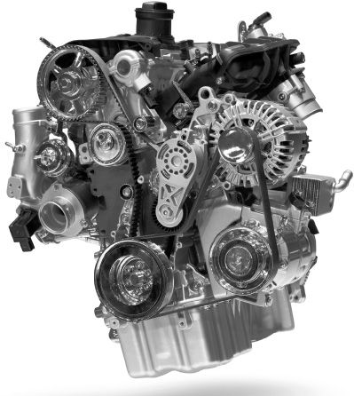

## 3.整体只是部分的总和吗
我们周围的世界很多事情都是复杂的，而不是简单的。例如，一部手机有许多小部件，这些小部件都以非常具体的方式组装成一个复杂但功能齐全的整体。如果我解剖一只老鼠，我发现里面是各种潮湿和粘稠的部分。根据我对生物学的了解，它们都会在保持老鼠的活力和活跃方面发挥了作用。有时一个物体从外面看起来很简单，就像一个橙色的水果，然后当我切开它时，我发现它的皮肤下也有部分。当我们在形而上学中说一个物体是复杂的时，我们通常的意思是它有部分。但是有一个问题需要考虑，这些复杂的整体是否只不过是以特定方式排列的各个部分的总和。正如我们很快就会看到的那样，这个问题很重要。然而，首先，我们应该多说一点关于复杂性。

我们可能会这样想。许多事情是复杂的，但至少有一些是绝对简单的：我们的意思是它们没有部分。然而，简单性的存在是值得怀疑的。我们过去认为有些东西很简单——例如原子——结果证明是复杂的。它们被分裂并发现内部有较小的颗粒。其中一些又被发现有零件。这使我们在可以知道什么方面处于困难的境地。问题是，虽然我们可以知道某件事是复杂的，但我们不能知道它是简单的。我们可以看到某物有部分;但是，如果我们看不到零件，我们就无法确定它们没有隐藏或太小而无法看到。在这种情况下，我们怎么知道任何事情都是真正简单的呢？我们可能只是错误地认为某件事是。

### 零件一直向下
必须有简单的吗？我们经常看到零件中的零件：例如在汽车发动机中。为什么我们不应该假设这种模式会永远持续下去，并且零件中总有零件？

有时坚持认为零件中的所有这些部分都必须在某个地方结束。所有的复合体都必须建立在不复杂的东西上。我们已经看到，观察的证据不能支持这一点，因为可能存在太小而无法观察的隐藏部分。独立理性似乎也没有决定观点。假设世界包含无限的复杂性，部分越来越小，这是否是一种矛盾？似乎没有确凿的论据说明为什么无限的复杂性不可能是这样。因此，那些相信一定有简单的人必须将他们的信念建立在另一种观点之上。

有一种哲学立场叫做原子论，它可能是这样的基础。原子论者是相信存在原子或原子部件的人。这里我们指的是原始意义上的原子：最小的可能事物，因此是不可分割的。化学理论的原子在这个意义上不是原子的。元素周期表中的原子包含质子、中子和电子。哲学意义上的原子论者认为，一切都是由最小的可能单位建立起来的，无论它们是什么。事实上，从理论上讲，只要说明所有原子的位置和它们的本质，就可以得到对世界的完整描述。我说“只是”这样做，但这当然是一项艰巨的任务：比人类历史上完成的任何其他任务都要大。但原则上这是可以做到的，这通常是哲学家的全部。

图3.一个复杂的特殊

从上面所说的可以清楚地看出，没有特别有力的证据支持任何形式的原子论。它更像是一种哲学立场，尽管一些这样的原子论者认为他们的观点是科学精神。尽管它没有在任何结论性的意义上得到证明，但它可能仍然是一个有说服力的假设。

这是本章真正要讨论的问题的前奏，即整体与其部分之间的关系。整体在某种意义上是大于部分的总和，还是只不过是总和？这似乎是一个奇怪的问题，但它实际上具有深刻的哲学意义，我希望它能变得清晰。

现在有很多情况下，一个整体看起来只不过是部分的总和。例如，考虑一堆石头。也许堆里有大约一百块石头。我们可以将桩视为一个整体，在这种情况下，它似乎只不过是一百块石头的集合。然而，即使在这种情况下，我们也可以注意到整体的某些属性不是零件的属性。让我们假设，这堆有一米高。但是，这堆石头中没有一块是一米高。它们都比这少得多。然而，我们可能会认为这种差异没有什么特别神奇的。整体已形成一个粗略的金字塔结构。单个石头并不是那么高，但它们的排列方式，有些大致在其他石头之上，它们可以组合各自的高度，使整体高度比其中任何一个都大。个别身高，如果安排得当，可以对整体的高度做出贡献。因此，整体具有部分所没有的属性，这完全可以用部分及其排列来解释。

到目前为止：太好了。但其他情况看起来有点复杂。再想想手机。它具有与一堆石头相同的一些特征。例如，它的长度只是由于其各部分的排列。但它的一些特性似乎不太容易解释。它有一些很难解释的能力。它能够发送和接收声音信号，从而可以远距离进行对话。现在大多数手机都具有广泛的其他功能。他们可以访问互联网，拍摄和存储照片以及播放音乐。

这些相当惊人的容量似乎与长度表壳不同。在那里，整体拥有更多已经由部分拥有的财产。他们每个人都有加起来的长度。但是在手机的一些操作的情况下，似乎没有任何单独的部分具有任何程度的能力。因此，与长度情况有所不同。并不是说手机的底部四分之一能够拨打四分之一的电话，而它大概有整个电话长度的四分之一。这种差异表明如下：在某些情况下，一个属性可以以度为单位，而整体只是比部分拥有更多的属性;但在其他情况下，整体具有部分在任何程度上都不拥有的属性。这可以从我们谈论事物的方式上反映出来。我们只称整个东西为电话，而它的各个部分不是电话。然而，对于一堆石头，我归因于整体的东西——它的高度——我也可以在较小程度上归因于部分。

### 全部真相
我在这里做了各种各样的假设，如果你成为一名专业的哲学家，你将接受发现和批评它们的训练，但由于这并不总是最有价值的实践，我会迅速前进。特别是，我想提请注意一个可能令人感兴趣的区别。

我已经讨论了两个整体的例子以及它们的不同之处。但也许这两个例子一开始就非常不同。在第一种情况下，我们只有松散零件的聚合。例如，我可以从我的石头堆的顶部取出一块石头，然后把它添加到另一堆石头中。但手机更像是一个整体。如果我拉上半部分，下半部分也会随之移动。它都正确地连接在一起，这并不是说它不能分裂或我不能把它打开。到那时，它可能只是另一堆零件，但在那之前，它似乎具有一堆石头所没有的统一性。出于这个原因，哲学家有时会将物质——整体——与单纯的集合体区分开来。

这种区别具有一定的意义。如果我替换堆中的一些石头，我就会得到一个不同的堆，因为我们假设骨料的身份是由零件决定的。如果我们有不同的部分集，我们就有不同的聚合，即使某些部分在不同的时间可能是不同聚合的成员。但是，如果我更换手机的一部分——也许是保护套——它不会因此而变成一部不同的手机（在第1章中讨论的数字身份意义上）。物质可以在其部件的变化中幸存下来，而仅仅是部件的集合体则无法承受。

本章其余部分讨论的案例都涉及这些物质或整体，因为它们提出了一些真正具有挑战性的问题。电话具有接听电话的能力，而其部件则没有。有一个问题要问，整体的这种能力是否可以完全用部分来解释。

当我们考虑这堆石头时，它的整个高度和形状似乎只是它的各个部分和排列方式的结果。但是，整体的性质及其一些相当特殊的能力也是如此吗？可以说，它仍然可能是。我不知道小型手机如何能够拨打电话、发送电子邮件和播放音乐。这些能力似乎很神奇。但我也认为这不是真正的魔术。某处的一些技术人员知道启用这些功能的部件是什么，以及必须如何排列它们才能使其正常运行。据推测，工厂的工人根据详细的规格组装零件。了解该技术的人大概都了解零件如何能够提供整体的所有特性和容量。从这个意义上说，只要这些部分排列正确，整体就是各部分的总和。

然而，在其他情况下，这一想法受到质疑。有些品质被认为是如此特殊，以至于它们出现在现实的某个更高层次上，而在部分的层面上找不到类似的品质。将桌子视为零件的组合是一回事：它的四个木腿排列在平坦的木质表面的底部。但是，我们能把人想象成以某种方式排列的各种肉块和骨头吗？人是有生命的。生命似乎是整个有机体的属性，我们似乎在各个部分找不到的东西。另一个明显的例子是意识或思想。我们在思考事物也能够体验和反思疼痛、瘙痒和颜色等感觉。精神是完全可以用身体来解释的东西，特别是大脑是注意力的焦点吗？还是精神是一种全新的特殊品质，只有在一定程度的自然中才会出现？

在这个问题上，哲学家可以采取两种广泛的立场。还原论者是坚持认为部分最终可以解释整体的所有运作的人。还原论者可能会承认，我们还不知道大脑如何产生意识的所有细节，但他们相信，最终，当科学发现所有事实时，我们将能够做到这一点。这是一个哲学立场。还原论尚未得到证实。然而，那些被还原论诱惑的人认为，已经有足够多的案例，这些部分已经解释了整体，我们应该概括并假设它是普遍的情况。

与这种观点相反，涌现主义声称整体不仅仅是部分的总和。有多种方式可以表达这样的想法，不同的新兴主义者可能不支持完全相同的事情。陈述观点的一种方式是根据我们所知道的，什么会让我们感到惊讶，或者我们能够预测什么。例如，如果我们对大脑及其神经元的工作方式了如指掌，那么可以说，即便如此，我们也无法预测意识现象，也无法预测体验某事的感觉。例如，神经科学家可能确切地知道当我们感知到红色的东西时大脑中发生了什么，但只有当他们自己体验到红色时，他们才知道看到红色是什么感觉。如果他们从未见过红色的东西，他们就不会知道看到红色是什么感觉，因为他们所获得的所有神经科学知识。

然而，也许令我们惊讶的仅仅是关于我们心理的事实，这并不能完全反映我们认为涌现主义所声称的内容。因此，在陈述观点的第二种方式中，涌现主义是一种关于存在什么的理论，而不是关于什么让我们感到惊讶的理论。涌现主义者真正要声称的是，在整体中可以找到真正新颖的现象，这些现象不在于它们的部分，也不在于它们的总和，也不在于它们的排列。正如很难知道还原论是否为真，也很难知道任何事情是否真的简单一样，也很难知道这种涌现论是真的。就目前的情况而言，我们没有详细的解释心是如何从身体部位出现的，但这可能只是因为我们的无知。我们还没有经过验证的理论，也几乎无法想象如何会出现一个理论。然而，我们从过去知道科学的进步如何使我们感到惊讶。

### 原教旨主义的乐趣在哪里？
关于世界，我们可能有两幅图景，以及所有科学如何相互支持。一个是倒金字塔。在底部是一门科学，据说其他一切都依赖于它。对于大多数还原论者来说，底层是物理学的科学：也许他们会说基础物理学，它涉及粒子及其支配它们的定律。除此之外，将是其他科学，例如化学，然后高于生物学。在更高的地方，我们会发现“科学”，如心理学、经济学、社会学和人类学。然而，还原论者认为，一切最终都建立在物理学的基础上，并由物理学来解释。所有的真理都是通过基本粒子和物理定律的安排而成真的。

与此相反的是，至少有一些科学具有一定程度的相互独立性。让我们考虑一下生物学，因为生命是一种所谓的涌现属性。有些人试图把生物学的所有真理简化为生物化学的真理，并说这一切都与DNA有关，而DNA可以简化为化学的真理，最终是物理学的真理。但是，仍然有一些令人信服的理由，为什么我们必须将有机体视为整体而不是部分的总和。例如，进化论的自然选择选择了相当高级的属性。长脖子使长颈鹿在食物方面比竞争对手更具优势，而不是与其DNA直接相关。

在某种程度上，似乎整个生物体使用其DNA在整体水平上为其提供所需的东西。如果这是真的，那么关于长颈鹿的微观物理事实就不会决定了整体的宏观可观察特性：而是相反。是整个生物在生存或死亡，进食或饥饿，有时繁殖;不是他们的基因或分子。说一个人的基因去散步似乎很混乱：走路的是人。同样，看到事物的是人。连眼睛都看不见;它们只是我们过去看到的。虽然我们的身体部位可以被描述为有生命的和有机的，但它们不是有机体，如果与整体分离，它们将无法长期存在。想想如果一只手从身体上分离出来，手还能活多久（是的，我看过 1946 年的电影《五指野兽》，但那只是幻想）。

这些考虑不是决定性的，但它们可能表明，在我们称之为整体主义的观点中至少有一些吸引力。这个想法是整体在某种意义上优先于部分。优先权的概念可以用各种方式解释。我们看到还原论者如何否认这一点。他们说，关于部分的事实决定了关于整体的事实。正如我们所看到的，整体主义者有多种方法来回答这个问题。一种是援引进化选择等情况，其中关于整体的事实似乎决定了关于部分的事实。拒绝还原论的另一种方法是否认本章的标题问题，并坚持认为整体确实不仅仅是部分及其排列的总和。

在心灵哲学和生物学哲学中，还原论和涌现主义问题是当前辩论的核心部分。形而上学在澄清涌现主义的真实性方面可以发挥作用。我们还没有做到这一点，希望未来的玄学家能够取得更大的进展。什么是让事物超越其部分是一个我们应该进一步探讨的问题。