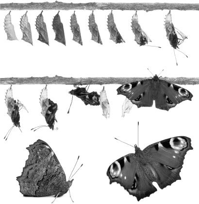

## 4.什么是变化
到目前为止，我们关切的是那里的情况，但只是最笼统的。我知道有桌子、椅子、手机、人和长颈鹿，但是，抽象地说，我们也可以说有细节，它们的属性，有时还有细节的一部分。没有比这更抽象的了。然而，人们也可能担心，到目前为止，我们的思维在很大程度上是由物理中型物体的例子引导的。当然，我们被许多这样的事情所包围，但我们不应该被引导认为这就是全部。即使我们描述了每一件事，也远不清楚我们已经描述了一切。当然，这听起来像是那种晦涩难懂和自相矛盾的陈述，但它仍然可能被辩护。我们所说的“物”通常是指对象，可能是物理对象。但并非一切都是物理对象。

我们有我们的特点，比如杯子、猫和树，我们有我们的属性，比如发红、脆弱和四足。但是，有人脸红，毛毛虫变成蝴蝶，铁棒发热，或者一本书从桌子上掉下来呢？这些是涉及更改的事件。那么更长的过程呢，比如太阳使西红柿成熟，第二次世界大战，或者一个小婴儿长成老人？整个宇宙从头到尾的历史如何？这些事件和进程似乎确实是现实的一部分。我们不想否认它们的存在。它们是我们世界的真实特征。但是，如果我们只谈论细节及其属性，似乎我们忽略了它们。列出细节及其所有属性，除非我们做出一些花哨的举动，否则只能给我们一个静态的描述，一次世界上有什么。然而，变化似乎和任何事情一样是我们世界的一部分。没有它，什么都不会发生。因此，我们需要将它列入我们的清单，并对其进行说明。

### 发生了什么？
事情发生了。这一点我们肯定知道，即使这一切都是一场梦。那么什么是事件？总是变化吗？过程有什么不同吗？让我们从考虑事件开始。

应该指出的是，至少有两种事件概念可用。一个允许它们可以是静态的，这意味着不变。中午的门是棕色的，这在某些概念上被认为是一个事件。这是最好的分类方法吗？也许最好把这种事情称为事实，因为什么都没有发生：什么都没有改变。然而，这可能只是个人喜好。我们可以称任何我们想要的东西为事件，只要我们清楚我们使用的是哪个概念。不过，我将坚持至少涉及一些变化的事件的概念，这是因为变化现象是我们本章的主要关注点。

上面提到了流程，这里更清楚的是，必须涉及变革，实际上是一些变革。虽然我们可以认为一个事件只涉及一个变化，但一个过程的概念似乎需要以特定的顺序发生多个变化。正如物体可以站在部分-整体的关系中一样，事件似乎也是如此。某些事件包含其他事件作为部分。对邻居说“早上好”涉及说“好”和说“早上”这两个事件。对于似乎允许更长和更复杂的更改的流程，它们可以拥有各种各样的部分。例如，第二次世界大战包含斯大林格勒战役作为一部分，而斯大林格勒战役又包含用一把枪发射子弹。

当然，事件和过程的概念是紧密相连的，它们之间可能只有模糊的区别。什么时候一个过程变得如此之小，以至于它只是一个事件;还是一个如此大的事件，以至于它是一个过程？我们可能无法强加一个非常尖锐的界限，但仍然坚持认为一个过程暗示了一个复杂的序列，其中有一个特定的顺序有多个变化。顺序很重要，因为如果我们更改它，我们将得到不同的过程。例如，建造房屋是一个过程，如果我们颠倒顺序，我们会得到其他东西，例如拆除房屋。因此，我们可以看到，变化的概念看起来对事件和过程都很重要，我们应该更仔细地研究这个问题。

图4. 蜕变

### 谁能承受变化？
在第1章中，讨论了细节，并引入了数字同一性的概念：同一事物的概念。这很难在不引起混淆的情况下陈述，因为我们想知道什么时候一件事与另一件事是同一回事。当他们存在时，我们真的只有一件事。出于这个原因，有些人说同一性根本不是一种关系：因为当它真正成立时，我们只有一件事，而所有真正的关系都至少涉及两件事。

为什么某些东西必须通过更改保持不变？这就是问题所在。如果2010年有一个有头发的男人，2020年有一个没有头发的男人，我们可以从这些信息中说，只有当2010年有头发的男人是2020年没有头发的男人时，才发生了变化。如果是同一个人，那么我们可以说发生了一些事情——发生了一些变化——一个男人变成了秃顶。2010年有很多有头发的男人，毫无疑问，2020年会有很多没有头发的男人，但为了改变我们需要一个有头发的男人变成一个没有头发的男人。它需要是一个秃顶的个体。这种认为变化需要一个主题的想法通常归因于亚里士多德;事实上，许多形而上学都来自他。

似乎我们可以对所有小规模的变化说同样的话，尽管当我们进入更大规模的过程时，可能不清楚变化的主题是什么。第二次世界大战变化的主题是什么？也许是世界？有些变化涉及多个主题。假设能量从一个物体传递到另一个物体，也许当两个斯诺克球碰撞时。能量的转移只是一种变化，涉及能量的重新定位，还是我们实际上有两个独立的变化：一个是母球的能量损失，另一个是物体球获得能量？计算变化不是一件容易的事情，这样做必须基于许多哲学理论。

这是这样一个理论。变化可以有不同的变化。变化可以是财产的收益或损失，某物的进入或消失，或者一个财产的变化。我们可以对每种情况进行更多说明。

我们正在利用我们对细节及其属性的概念。假设在某个时候，一个特定的人有一个属性：番茄是圆形的。但后来西红柿不再具有这种特性。然后发生了变化。当然，在那段时间里，西红柿可能已经获得了另一种特性来取代它以前的圆度：它可能已经变得扁平，在一辆经过的卡车的车轮下被压扁。同样，我们可以说发生了变化。这只是一个变化还是两个变化？是将一个属换为另一个属性还是两个相关但不同的事件：圆度的损失和平坦度的增加？

属性内的变化是另一种变化。我正在考虑的情况是，某物具有长度属性，但会增加或减少它。假设番茄旁边的黄瓜长度从 20 厘米长到 30 厘米。当然，已经发生了变化，毫无疑问，这是一个渐进的变化，从20厘米到30厘米，黄瓜的长度穿过中间的所有中间长度，而不是直接从一个跳到另一个。在这方面，这种变化看起来像是一个过程。但重点是长度是一个单一的属性，可以以度、大小或不同的数量出现。另一种思考方式是说，有各种确定的长度属于可确定的长度概念。当黄瓜生长时，它保持相同的长度可确定特性，但改变其确定的长度，一个切换为另一个。

我建议还有另一种改变：一些东西存在或消失。在这里，变化不是发生在事物的属性中，而是发生在事物本身。它存在或停止存在。这些都是非常令人费解的概念。一辆新车可以下线，例如，新造的，几年后，它可以去废料场拆解。也许没有任何东西真正被创造或破坏，相反，零件 - 以及零件的一部分 - 只是以不同的组合组装或拆卸并在其他地方使用。还记得有人告诉人们能量既不能被创造也不能被破坏吗？这让你想知道它最初来自哪里。但是，我们不必思考太久，因为要说发生了变化，我们所需要的只是在相对微弱的意义上存在或消失，即部分已经形成了一个新的整体或从一个整体中解体出来。我知道当我的车被拆开时，即使这些零件或零件的某些部分仍然存在，也会发生变化。

然而，这种变革理论存在挑战。亚里士多德关于存在变化主体的概念，在变化中持续存在，在更现代的时代受到质疑。也许这是因为我们认为空间和时间比过去更相似。这需要解释。

人体有空间部分。它有一个上半部分和一个下半部分。还有一只胳膊，一颗心，一个脚趾，还有更多。这些都可以被认为是身体的空间部分：空间中的部分。但是，为什么不也允许有时间的部分：时间的部分呢？该机构的一部分存在于2010年，另一部分存在于1970年。今天 12.05 有一个部分只存在了一分钟。当然，如果空间和时间之间有一个密切的类比，它表明应该有时间部分。

但为什么这很重要？有些人认为时间部分是解释变化的好方法。这些哲学家指出的问题是，在古老的亚里士多德理论中，事物通过变化而持续存在，不同的品质必须归因于同一个特定因素。番茄既有绿色的特性，也有红色的特性。黄瓜长20厘米，长30厘米。然而，如果一个人相信事物有时间部分，那么他就可以说是不同的事物具有这些不相容的属性。西红柿的一个时间部分是绿色的，另一个时间部分是红色的。与空间的类比再次成立。听到一个西红柿既是红色又是绿色的，如果一个空间部分是红色的，另一个是绿色的，我们并不惊慌。如果存在不同的部分，无论是空间的还是时间的，都具有不相容的性质，那么任何明显的矛盾都会消失。

### 全场
如果你不接受时间部分，你必须找到一些其他的解释，解释某些东西似乎如何能够承受不相容的属性。在亚里士多德的理论中，一个特定被认为是在它存在的每个时间都完全存在的。红色的不是番茄的时间部分，而是整个西红柿。事实上，我们说“西红柿是红色的”。我们不会说“番茄的颚部是红色的”。话又说回来，也许语言的使用不是形而上学的可靠指南。

亚里士多德的观点被称为耐力主义，因为完全存在的细节通过变化而持久。但是，这种观点如何解释不相容性能的轴承呢？答案当然是，这些不相容的特性在不同的时间产生。西红柿上周是绿色的，而本周是红色的。然而，这种回答是有代价的。这意味着属性不是由细节纯粹和简单的。它们总是必须相对于其他东西持有，即特定时间，这使我们对拥有财产的解释变得复杂。相反，那些相信时间部分的人，被称为perdurantists，可以说时间部分具有纯粹而简单的属性，不需要任何进一步的关系元素。

当事物发生变化时，我们不应该把它看作是一个具有相反属性的单一事物，而应该将其视为具有这些属性的不同事物 - 时间部分。如果观点试图解释变化，那么这意味着这些时间部分中的每一个本身必须是不变的。如果一个时间部分本身能够经历任何变化，那么最初激发观点的问题就会重新浮出水面。因此，很明显，每个微小的变化都必须有不同的时间部分。

这种变化也必须从根本上重新定义。我们所拥有的不是通过属性的变化而持久的变化主体的想法，而是一系列具有静态属性的事物，与紧接在它们之前和之后的事物略有不同。在某种程度上，变化是这种时间部分的连续所造成的幻觉。但这个想法对我们来说并不陌生。它更像电影院使用的老式电影。胶片条的每一帧都是一幅不变的、不动的画面。但是它们在能够非常快速地翻转图片的设备上按顺序排列。当快速连续观察时，它看起来像运动。对于顽固主义来说，我们的世界非常像这样运作。

尽管如此，我们还是有一些很好的理由可以怀疑这个理论。首先，它看起来更像是对变化的否认，而不是对变化的理论。每个时间部分都是完全不变的，因此上述各种变化都归结为（时间部分）的存在和消失。也许更严重的是，将事物视为一系列时间部分的概念是有问题的，因此对随之而来的变化的描述也是有问题的。

在什么意义上，许多不变的时间部分都属于同一事物？如果一个人遵循理论的文字，他们就不会。正如我们所看到的，没有经久不衰的东西。相反，我们认为的只是静态部分序列中的一些构造。因此，需要以适当的方式连接零件的集合，以便它们使我们成为持久的东西。这将是一个在各部分之间找到正确的关系的问题。时间的连续将是一个要求，因为大概同时存在的两个不同的时间部分不可能是同一事物的一部分。也许因果关系是另一种关系，其中早期的时间部分导致后期的时间部分（因果关系是我们下一章的主题）。

看来，我们需要以某种方式从各部分的连续中构建这些细节，然后才能谈论已经发生的变化。換句話說，要說一個人已經變成秃頭，我們首先需要通過以某種方式將它們聯繫在一起，從時間部分中建構出這個人。我们的问题是，如果2010年的毛头男人是2020年的秃头男人，我们只能说发生了变化。但这关键取决于证明毛头男人与秃头男人有适当的关系。

因此，我们在伪装主义中遇到了一个问题，即适当地连接所有这些不同的部分。但是，我们真的希望我们的变化是由最终不变的组件构成的吗？我们周围看似平滑的变化只是静态部分的连续，这真的合理吗？这将是一个生涩的世界，从一个州跳到另一个州，尽管据说速度如此之快，以至于我们没有注意到连接。在这里，耐力主义的吸引力可能会以修改的形式回到清算中。我们可能会看到世界在不断变化。持续、扩展的更改将是一个过程。因此，也许动态过程构成了世界，而不是由一系列不变的部分构成的。这个想法是，我们世界中的过程发生在平滑、不可分割和完整的整体中。

例如，当您考虑糖在茶中的溶解时，这似乎是一个自然而连续的过程。Perdurantism会把它描述为一些不连贯的时间部分的集合，这些部分恰好落在正确的关系中，以便我们把它们粘在一起。但也许这个过程的所有部分都是必不可少的。可溶性就是对这个过程的倾向，而且这个过程必须恰好是这样的。我们可以说许多其他过程也是如此：它们似乎是集成的、连续的整体。考虑光合作用、人类生命周期或结晶。我们真的希望将它们视为任意连接在一起的部分集合，并且原则上可以以任何旧顺序发生吗？我不建议，因为过程似乎提供了一个合理的案例，即整体大于部分的总和。

现在是时候从变化转向明显相关的事物了。我们已经开始侵占下一章的主题，这将是所有哲学问题中最大的问题之一：因果关系。