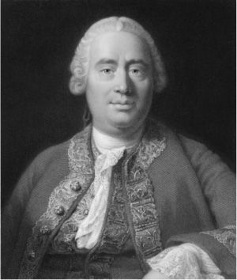
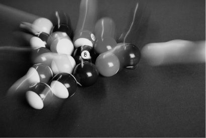

## 5.什么是原因
我把一个足球踢向球门，它进去了。我的队友们来祝贺我。为什么？因为我进球了。这是我做的。我造成了进球。后来，我打翻了一个杯子，它砸碎了。我明白了。为什么？再一次，责任落在了我身上，因为我导致了一些事情的发生。人类不需要参与这些例子。飓风造成树木损坏和洪水;或腐蚀的铆钉导致桥梁失效。

有时一件事与另一件事相连，这非常重要。我的踢球与它的移动有关。但是，如果我们考虑世界上所有事件的整体，它们中的大多数都没有直接联系。拿破仑在滑铁卢的失败，我想，与你抓鼻子无关。通过许多其他干预事件，可能会有一些非常间接的联系，但这将是一个如此脆弱的联系，它不会很重要。在其他情况下，一种事物是否与另一种事物有关存在争议。例如，烟草公司多年来一直否认吸烟与癌症之间存在任何联系。神秘主义者声称他们可以直接与他人交流思想或仅凭自己的意志移动物体，而其他人则否认心灵感应和心灵感应都是真实的。实际上，这是对因果关系的否认。

我们一直在考虑构成我们世界的一般事物。我们已经查看了属性，细节，复杂的细节，然后是变化。原因似乎是我们需要考虑的另一个重要类别。这个主题与更改的主题密切相关，尽管它并不完全相同。世界上的许多，也许是大多数变化都是由其引起的，但并非所有变化都需要引起。在某些方面，宇宙起源于大爆炸，这是一个巨大的存在。因此，这听起来像是一种变化，但我们也被告知它是无因的，因为以前不存在可能导致它的原因。因此，我们可以区分引起的变化和未引起的变化。所以变化和原因是不同的东西。事实上，即使它们在一起，我们也应该说它们是不同的东西。原因将是产生变化的原因，而它确实是引起的变化。只是为了更清楚地区分这两个概念，我们也可以说有原因没有变化。有时原因会产生稳定性或平衡性。例如，磁铁可以保持在一起，而不会发生任何事情。但这似乎与任何其他例子一样明显。

### 无处不在的原因
对因果关系的理解是所有哲学中最大的任务之一：不仅仅是因为哲学家们几个世纪以来一直在担心它。我们必须对因果关系进行说明，因为它几乎将所有东西结合在一起，因此休谟将其描述为“宇宙的水泥”。我们几乎到处都能找到它，没有它，其他任何事情都无关紧要。例如，弗朗茨·斐迪南大公被枪杀意义重大，只是因为它导致了他的死亡，据说导致了第一次世界大战。事实上，加夫里洛·普林西普扣动扳机只是因为他相信这可能会导致子弹离开枪，然后子弹可能导致弗朗茨·费迪南德死亡。

我们执行的任何行动似乎都以它会导致事情发生的想法为前提。例如，我敲钉子，只是因为我希望它会导致钉子沉入墙壁。如果锤击与结果无关，那将是一项完全没有意义的活动。假设它没有导致钉子沉入墙壁。或者假设当你锤击时，发生了一些随机变化：指甲可能会蒸发，或者消失，或者变成一只鸡。如果任何东西之间没有因果关系，我们的世界在任何程度上都是完全不可预测的。就目前情况而言，我们的预测并不完全可靠，但足够可靠，足以让我们过得去。事实上，它们的存在取决于存在因果关系。确定它们是什么对我们来说通常至关重要。例如，确定疾病的原因可能至关重要。我们可以通过让人们远离死亡原因来拯救生命。或者，我们也想找到能够使人们康复的药物，即使他们感染了这种疾病。

这些例子传达了因果关系的重要性。这使哲学家有责任理解并告诉我们什么是因果关系。但在这里，它变得困难了。

### 为事业而战
一个问题是来自大卫休谟的传统思想，他关于因果关系的思想继续塑造哲学辩论（A Treatise of Human Nature，Book I，1739）。休谟告诉我们，因果关系是不可观察的。我们可以看到一个事件，比如有人吃药，当他们好转时看到第二个事件，但我们从来没有看到这两个事件之间的因果关系。那么我们怎么知道药物导致了康复呢？问题比我无法看到某人的身体内部（很容易）更深层次。即使在最简单的情况下，休谟也声称我们永远看不到因果关系。你可以看到踢球，你可以看到球在移动，但你看不到踢球和球移动之间的任何因果关系。

图5. 大卫休谟

如果我们谁都看不出因果关系，那我们为什么相信它们是真实的呢？休谟对此有看法。我们认为第一个事件导致第二个事件的主要原因是它是模式的一部分。每当我看到有人踢球时，球就会随之移动。我只是在每个实例中看到一个事件紧接着另一个事件;但我也知道，每当我看到第一种事件时，它之后就是第二种事件。

对于休谟的许多追随者来说，这不仅仅是关于我们对原因的认识。一种流行的观点是，这是对现实中因果关系的描述。在你读过哲学之前，你可能会认为一个事件可以让另一个事件发生。在第一个事件和第二个事件之间有某种推动或强迫。然而，Humeans除了说我们对任何这种推动一无所知之外，还说我们不需要这样的东西来理解世界。只需要事件和它们所陷入的模式。许多踢球类型的事件已经发生，许多足球已经移动。碰巧的是，踢球事件之后是球移动。然后，世界被理解为由不相连的事件拼凑而成，其中一些恰好落入模式。

例如，考虑一下，如果你有一大桶马赛克瓷砖。你可以给他们摇一摇，然后把它们倒在地板上。他们实际上会以随机安排落下。但即使在这里，当我努力研究瓷砖时，我也许能看到图案。我可能会看到红色瓷砖总是在蓝色瓷砖旁边，或者方形瓷砖总是在三角形瓷砖旁边。当我越来越努力地思考时，我可能会注意到更精致的图案：圆形黄色瓷砖总是在绿色正方形或橙色三角形旁边，依此类推。然后我们可以说，这就是我们科学调查世界时所做的一切。如果服药后总是从疾病中恢复过来，那么我们还能想要什么因果关系呢？

然而，还有另一种想法诱使一些人转向另一种观点。休谟也持这种观点，他提出了两种不同类型的理论。一是因果关系只是规律性。另一种理论需要不同的解释。我们经常通过世界上的实验来了解是什么导致了什么。小时候，你可能会拉动并松开娃娃脖子后面的绳子，发现娃娃会说话。你可以这样做几次，看到拉绳子之后是娃娃说话的规律。然而，可以说，要真正获得因果知识，您还需要知道，除非您拉绳子，否则娃娃不会说话。

图6. 因果关系

毕竟，如果娃娃一直在说话，无论你是否拉动它的绳子，你都不太可能认为拉绳子导致了说话。由此得出一个见解。我们可以将原因视为一个事件接一个事件，另一个事件，如果第一个事件没有发生，第二个事件也不会发生。这几乎是休谟的原话。

但是我怎么知道呢？我可以看到一个事件之后是另一个事件，但我怎么知道如果第一个事件没有发生，而事实上它发生了，第二个事件就不会发生？有人担心，一个人相信第二个事件不会发生，实际上会因为相信第一个事件导致了第二个事件。这不好，因为理论应该告诉我们一个事件引起某事是什么，所以它不能依赖于先验的原因概念（因为那样它将是一个循环解释）。

这个问题有两个答案。一个采用了一些精心设计的形而上学，而另一个则更加脚踏实地。哲學家的回答是，雖然在我們的世界中，第一個和第二個事件都發生了，但還有另一個世界和我們的世界一樣，只是在那裡，第一個事件沒有發生。如果在那个世界里，第二个事件也没有发生，那么在我们的世界中，第一个事件导致了第二个事件。換句話說，鑑於這兩件事都發生在我們的世界中，我們只能考慮第一個事件在其他可能的世界中沒有發生的可能性。要考虑的世界是最像我们的世界，但事实上第一个事件没有发生。这将充实休谟的第二个因果关系理论想要的东西。事件A导致B，因为在世界上，就像我们一样，除了A没有发生之外，B也没有发生。

这种对其他可能世界的讨论似乎是一种形而上学的奢侈。我们将在第8章中再次遇到这样的世界。但可以说还有另一种方式可以知道，如果一个事件没有发生，第二个事件就不会发生。这是一种更科学的方法，经常付诸实践。我们可以进行实际的实验，而不是思考其他世界发生了什么。为此，我们需要设置两个在我们能想到的每个方面都尽可能相似的测试用例。然后，在一个测试用例中，我们介绍相关事件。在第二种情况下，我们没有。然后我们看看引入的因素是否对结果产生了影响。 约翰·斯图尔特·密尔称之为差异方法。

根据一些人的说法，这种方法是我们在现实中发现原因的方式。例如，为了看看一种药物是否有效——我的意思是它是否会导致康复——我们将一大群人随机分为两组。如果数字足够大并且随机化是真实的，那么我们应该得到两个足够相似的组。然后，我们将试验药物给予一组，不给第二组。第二组服用安慰剂，以防万一仅仅相信你正在接受治疗本身就会导致康复。如果第一组好转而第二组没有好转，则宣布是药物导致了康复。这种实验被称为随机对照试验，旨在大量证明休谟和密尔在理论上的建议。我们能够在实际实验中看到，如果没有第一件事（服用药物），我们就不会有第二件事（恢复）。

这是这类理论的一个大问题，它们被称为因果关系的反事实依赖理论。这种差异真的是因果关系的全部吗？也许它让我们了解是什么导致了什么，但它实际上并没有告诉我们一件事导致另一件事是什么。这样看。服用该药的组会变得更好，无论其他地方是否有另一组服用安慰剂。假设由于行政错误，原定服用安慰剂的小组被遗忘，并且该部分试验从未发生过。这是否意味着第一组虽然好转了，但不是由药物引起的？如果他们服用并康复，他们很可能会质疑其他地方发生的任何事情是否与药物对他们的效果如何的问题有任何关系。同样，如果我踢一个足球并且它移动了，那么我的踢是否导致它移动的问题怎么会受到其他可能世界中发生的事情或一些没有人踢球的重复测试情况的影响？

这种推理背后的想法是，当我们有两个事件，A和B时，A是否引起B的问题单独是关于A和B的，以及它们之间存在或不存在的任何联系。在其他时间和地点发生的事情似乎应该是无关紧要的。这种观点被称为奇点主义。如何证明这种观点是正当的呢？一种方式是说，重要的是，例如，药物是否具有产生康复的真正能力。特别是，我可能想知道这种药丸是否有能力使这个特定的病人好转。如果是这样，那么当以正确的方式服用时，它会导致恢复。同样，当你踢足球时，让它移动的是踢球的因果力量。只有脚和球与此相关。

这让我们对我们所考虑的两种Humean观点有话要说。首先，因果关系在于规律性。单点主义者会声称这种观点存在一些问题。它似乎混淆了特定的因果关系和一般的因果关系。一个特别的说法是，这种药物使这个病人好转。一般的因果关系是，这种类型的药物可以使任何人变得更好。当我们声称吸烟会导致癌症时，我们是在提出一般的因果关系。该理论认为，一个特定事件引起另一个事件就是因为它是模式的一部分：换句话说，必须有一个一般的因果事实，而特定案例只是其中的一个实例。

休谟的反对者可能坚持认为，这里的解释顺序是错误的。之所以有一般的因果真理，是因为有一些特定的因果真理是我们概括的。这个人吸烟，导致他得癌症，那个人也因吸烟而得癌症，等等，我们可以概括所有这些特殊的因果关系，说吸烟一般会导致癌症。

### 对于休谟来说，钟声响起
然而，特定和一般因果真理之间的联系可能并不那么清晰和简单。我们都知道有些人设法吸烟一辈子而不会患癌症。尽管如此，我们仍然认为吸烟会导致它。那么，一般的因果真理意味着什么或意味着什么呢？我们可以说以下几点。吸烟容易产生癌症。在许多情况下，它确实如此，但并非在所有情况下都如此。力量就在那里——烟草是致癌的——但在某些情况下，它无法完成其邪恶的工作。有人可能只是拥有能够防止烟草影响的正确基因。因此，可能存在一个普遍的因果真理，但并不适用于所有个案。因此，随机对照试验可以表明一种药物对某种疾病有效，但这可能仅基于统计数据。试验组中的一些人可能会好转，但不是全部。在这种情况下，可以想象这种药物对我个人没有影响。

可能有很好的理由说明为什么一项事业对某种事情起作用，但不是全部。休谟知道因果权力观点是他自己的替代品。但他认为，这种观点意味着原因必须必然是其结果。他认为，如果有一种力量可以产生某种效果，那就意味着它在运作时必须产生效果。但这不一定是立场。一种权力可能只会达到某种效果。在某些情况下，它可以成功地产生这种效果，但在其他情况下，它可能被阻止完成其工作。我们周围看到的影响往往是许多不同因素共同作用的结果。例如，当一架纸飞机被抛出时，它的轨迹取决于它的空气动力学形状，但也取决于重力、阵风、静电吸引力和排斥力等。可能是其中一些因素在一个方向上处置它，而另一些因素则在相反的方向上处置它。

就药物而言，我们可能会发现药物具有治愈的能力，并且在许多情况下都成功治愈。但某个特定的人可能会发现它没有效果。也许他们在体质上对它免疫，或者他们有一种抵消它的生活方式，或者他们的饮食会加重疾病，或者无论如何。药物的存在，即使它经常产生恢复，也不一定总是这样做。以这种方式理解，权力并不需要其效果。休谟认为这是拒绝权力观点的理由，即他们可以被阻止或干涉。我们看到的是，它们不会通过必要性起作用，但这不是拒绝权力的理由，正确理解。

熟悉的亚里士多德这个名字再次出现。他似乎认为因果力量是现实的一部分。休谟的异议来得晚得多，但对哲学的影响同样强烈，当代形而上学者在胡米人和非修行者之间仍然存在着很大的分歧。关键的争论似乎是在那些认为原因确实产生了结果的人和那些认为只不过是一种事件模式的人之间，他们之间没有真正的联系。然而，作为警告，应该指出的是，Humeans认为，“生产”，“原因”，“权力”等等，我们只能意味着定期继承，或者说，如果原因不存在，结果也不会存在。现实主义者所说的关于因果关系的一切，都可以翻译成关于事件模式的休米亚术语。然后，甚至很难说出Humeans和他们的对手之间的区别。