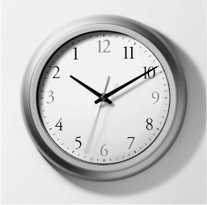

## 6.时间是怎么流逝的
我们一直在考虑一些最一般的类别。有细节和属性，但也有整体、部分、变化和原因之类的东西。后两者不可能存在，除非还有别的东西：时间。要发生更改，至少必须同时存在以后不再存在的某些内容，反之亦然。哲学家们争论没有变化是否会有时间，但可以肯定的是，没有时间就没有变化。

我们称之为时间的这个东西是什么？这也许是我们所有人都思考过的问题，这样做我们将从事形而上学。一种想法是，时间本身就是某种东西，是事件所处的背景。我们认为这个时间是流动的，有方向的。它可以与你擦肩而过。你需要跟上它，而不是浪费它。它已经到了一定的地步。也许这是一种有限的资源。这种时间的形象可能类似于河流的流动。它以一定的速度移动，经过河岸的某些点。在您出生时，您跳上木筏，河流将您带到下游，沿途经过岸上的所有路标岁月。在你死后，你跳下木筏，时间的流动在没有你的情况下继续前进。

图7.时间的方向

然而，其中一些想法似乎确实令人费解。我们谈论时间流动，但是，虽然我们可以测量河流的速度，但我们真的能对时间做类似的事情吗？如果时间过去了，它过得有多快？大概是每秒一秒？这有意义吗？还有其他答案吗？如果我在木筏上划桨，我能比时间本身走得更快甚至更慢吗？我们说时间是有方向的。我们说它向前而不是向后，但我们对此断言什么？也许时间终究是在倒流。如果是这样，会是什么样子？

将时间本身视为一个事物，独立于其中的事件而存在某种存在，也表明可能存在一段时间内什么都没有发生。这真的有可能吗？我怎么知道没有一年的间隔，一切都停滞不前，然后又恢复？或者也许是两年的差距。

当我们讨论时间时，我们发现它很难掌握，以至于我们不得不诉诸隐喻。然而，这些可能会产生误导。我可能会说时间已经过去了，或者说时间已经过去了很长时间，但这些不可能是真的。长度是归因于空间的东西，而通过归因于运动，就像一只狗从我身边跑过一样。也许人们的想法是，某个事件或过程——例如你的青少年时期——来自未来，进入现在，但随后又消失在你的过去。你可以向他们挥手告别，就像你看到狗跑上来一样，有一段时间他在你身边，但后来他又走了。时间就这样过去了吗？

### 现在多久了？
在过去的一个世纪里，形而上学者们一直在争论两种时间模型。我将花一些时间在第一个。

想想像亚伯拉罕·林肯总统遇刺这样的事件。对于那些生活在1865年之前的人来说，这个事件是在未来。对我们来说，这个事件已经成为过去。14 年 1865 月 10 日华盛顿特区晚上 15 点 <> 分左右，这是一个现在的事件。我们应该从空间类比的角度来理解这种情况吗？事件是否悄悄地出现在人们身上，短暂地达到现在，然后进入过去？还是我们应该以其他方式理解它？

有一种观点仍然具有一定的可敬性，其中事件具有某种时间属性。林肯遇刺有一个过去的性质。许多事件具有在场的属性，例如您阅读这句话的事件（并在阅读时考虑所有其他事件）。许多事件都有未来的属性，这个属性可以称为未来。卡塔尔足球世界杯、下一届英国大选、21 年 2025 月 2012 日的日食以及地球人口达到 <> 亿都是例子，据 <> 年所知。

在这里，我们可以对时间的方向有所了解。事件总是首先是未来，然后是现在，然后是过去。据我们所知，它永远不会朝着相反的方向发展。如果倒退时间旅行是可能的，这可能会使它复杂化，但似乎三个时间属性总是按照这个顺序拥有。当然，我在这里将事件视为细节，而不是形而上学者所说的类型。奥运会每四年举行一次，但我们指的是一种事件。每届奥运会都是一次性的，我所指的正是此类事件。这些事件从未来“流动”，通过现在，进入过去。

时间属性会有一些奇怪的特征。似乎他们可以以不同的组合来来去去。曾经的未来现在可能已经成为过去。在我写这篇文章的时候，2025年的日食是未来的，但最终它将成为过去。也许你在它发生后正在阅读这篇文章。这从我 2012 年的立场向我表明，它具有未来过去的特性;也就是说，未来的事件最终将成为过去（例如，到 2025 年 1860 月）。还有一个过去的未来。林肯遇刺是1865年的未来，但现在不再是了。自<>年以来，他的暗杀就没有未来。然后，人们可能会想知道事物如何具有这样的品质，以及当它们发生变化时会发生什么。是不是有很多东西站在某个地方，具有未来的属性，等到它们获得当下的属性？有没有未来的人渴望在场，心想“现在多久了？当他们获得过去的属性时，他们会去哪里？有没有任何东西真的有这种属性，或者仅仅是它们消失了？

### 没有时间像现在这样
有一种观点认为，只有现在才是真实的;恰当地，它被称为当下主义。这可以被认为是对刚才提出的一些问题的回答。因为说有些事物具有未来性和过去性的属性，这不是荒谬吗？存在似乎是承载属性的条件，但人们可以争辩说，未来和过去的事物根本不存在。巴拉克·奥巴马出生于1961年。如果说他存在于1959年，尽管当时具有未来的属性，这难道不是误导吗？凯撒大帝确实存在过一段时间，但现在他没有了。如果说他现在存在，但具有过去的性质，那也是错误的。因此，似乎可以说，与其说存在三个时间属性，不如用一个简单的存在概念代替，允许事物进入和消失。当存在时，它们是真实的。在那之后，他们不是。

这似乎是一个明智的观点，但这里有一些问题需要考虑。首先，现在能持续多久？是今天，还是这一分钟，还是只是一秒钟？晚上20：50，今天中午肯定已经过去了。事实上，连20点49分都过去了，两秒钟前也过去了。现在似乎只是一小块。我们可以等待它的存在，但它消失得太快了。事实上，如果有一个最小的时间单位——一些微微秒，我们可以称之为瞬间——那么现在似乎只和那个瞬间一样长。如果我们否认这一点，而是争辩说现在有一些延伸，那么我们应该允许它存在多久？两分钟？这看起来是一个武断的数字。然而，如果我们不允许现在有一些时间上的延伸，它似乎几乎消失得无影无踪。

这是当下主义的第二个问题。现在的概念受到相对论的挑战。我可能认为太阳现在正在闪耀，因此它似乎是现在的一部分。但我也被告知，太阳的光到达地球需要8分19秒。绝对同时性在物理学中受到了挑战，我们被告知说两个空间上分离的事件同时存在是不合法的。你可以看到两颗恒星在遥远的星系中坍缩，看起来好像它们同时坍缩。但是，如果一个比另一个离你的望远镜近得多，那么这些事件根本不是同时发生的。那么，就有一个问题，当现在似乎总是相对于一个立场或观点时，我们所说的现在到底是什么意思。我们可以满足于对现在的纯粹主观描述——对于一些观众来说，它似乎是现在的样子——但我们中的许多人不希望我们的形而上学如此依赖于一个人的观点。我们喜欢觉得我们正在处理客观的、永恒的、不变的真理，不受人类对事物的看法的影响。

说到这里，当下主义还有一个问题。虽然凯撒没有活着，但有一种强烈的感觉，即使在现在，他仍然是真实的。有关于他的事实——他越过了卢比孔河——而且一定有一些东西可以证明这些事实是真实的。如果只有现在存在，那么第二次世界大战或林肯遇刺是真的是什么？说那些过去的事件和事情是我们现实的一部分，即使它们不存在，这不是明智之举吗？鉴于相对论的上述考虑，我甚至可以看到一些过去的事实：例如，八分钟前的太阳是什么样子的。如果我们否认过去发生的事情的任何现实，有什么可以阻止某人改写历史？

### 接受牧场化
因此，有一种观点对过去和未来有不同的看法。将未来人站在周围等待出生的想法称为荒谬是一回事。但过去并不完全相同。它确实存在。它当时在场。从这个意义上说，它应该算作现实整体的一部分。那么，成为现实的一部分，而不是现在，可以解释我们的过去属性。

这种观点通常被比作一个不断增长的块。人们可以把现在想象成一个大实心长方体上的薄薄层。新层一直在其顶部表面上添加。凯撒，以及他所做的一切，都在街区里，在一段不远处。当我们谈到存在的东西时，我们可以指两件事。现在存在的只是我们块的顶面，它只是短暂地处于那个位置。也许它只是块厚的几个分子。但我们也可以指整个块的存在，这是从开始到现在的全部存在。过去现在是其中的一部分。但是，随着新的层次被添加到不断增长的块上，以前的当前事件逐渐消失在远处。我们可以说它们被放牧了，只是因为有一个建立在它们之上的新未来。

因此，我们已经从一种对现在享有特权的观点转向一种既享有现在和过去，但不是对未来都享有特权的观点。第二种观点仍然必须面对什么是存在的问题：它有多薄，以及绝对同时性的问题。在某种程度上，将现在和过去视为事件或事物的属性仍然存在问题。不断增长的块状图只是摒弃了未来的属性。

我之前说过，哲学家们争论过两种时间模型。第一种试图用具有现在性、过去性或可能未来的属性的事件和事物来解释时间的流逝。但我们已经看到，这导致我们动不动就说奇怪的话。也许问题在于，我们开始寻找一种理论，以满足我们对时间流动的形象：它像河里的水一样流逝。但是，有一种理解时间序列的不同方法。在这种观点中，没有现在性的属性，也没有过去性，也没有未来性。相反，我们只能说，我们世界上的事件和事物是相互有序的。它们在时间上是相关的，并且在某种程度上可以站成一个序列。

### 早、晚或准时
可以建立这种序列的基本关系是早于、晚于和同时。奥巴马的出生当然早于他的去世，但它比林肯遇刺晚，而林肯遇刺本身也早于肯尼迪遇刺。正如我们所看到的，同时性的概念受到了挑战，尽管这只适用于不同地点的事件。因此，我可以合理地说，奥巴马的出生与他的第一次呼吸同时发生，因为这些事件发生在同一个地方。

根据这种观点，时间的流动或流逝可以被视为一种误导性的隐喻，旨在适应事物和事件之间早于和晚于的关系。属性没有变化，从现在到过去。在这个新系列中，事件之间的时间关系一直存在。在任何时候，奥巴马的出生都晚于林肯的去世。没有什么必须从一个状态传递到另一个状态。我们也不需要把时间看成是类似事物的，比如事件发生的媒介。因此，也许不必担心是否有时间没有变化。相反，我们可以把世界上所有的事件都按顺序排列——什么在什么之前——然后我们就有了时间的顺序。

最后一个想法把我们带到了一个非常重要的问题的核心：在这个问题上，柏拉图主义和亚里士多德主义的另一个分歧。在整个章节中，分歧一直潜伏在背景中。我们是否将时间视为客观真实的东西，无论其中是否发生任何事件，它都存在它本身？还是我们认为时间只不过是事件的有序顺序？

在本章的开头，我几乎建议我们需要时间的现实作为可能发生变化的背景。但亚里士多德看待它的方式是从变化开始——也许是世界的所有变化——并将时间视为它们的某种建构。如果一切都停滞不前一年，然后不明显地从中断的地方恢复的想法似乎很荒谬，那么亚里士多德的观点可能更具吸引力。时间会从第一个事件开始：大爆炸，如果你愿意的话。“大爆炸之前”存在任何东西的想法对亚里士多德来说是荒谬的，但对柏拉图主义者来说不一定是荒谬的。后者也可能支持对大爆炸在什么时候发生的问题的严肃回答，就好像有某种神圣的天文钟可以确定一切的日期一样。对于亚里士多德主义者来说，第一个事件是时钟开始滴答作响的点。

人们可能会对将亚里士多德的观点与所谓的关于事件和事物的永恒主义联系起来有一些吸引力。我们考虑过现在或现在和过去享有特权，但永恒主义者认为所有事件都同样真实，即使从一个角度来看它们是未来。我不知道2020年奥运会是否会成功结束，但是，如果他们成功了，永恒主义者会把它们当作现实的一部分。这听起来可能令人困惑。再次交易区块的形象，永恒主义者认为现实是过去和将来的一切的巨大方块。我们位于中间的某个地方，能够回顾比我们更早发生的事情，但无法看到比我们更晚发生的事情。但这一切都是真实的。

当我们考虑存在的东西时，我们有时会试图只从三维角度思考这个问题：整个空间中存在的东西。但是，我们难道不应该从四维的角度思考：关于整个空间和时间中存在的东西吗？奥巴马的出生早于他的死亡。如果其中一个事件还不是真实的，我们就无法维持这一点（正如我在 2012 年写这篇文章时）。为什么这么说呢？这种想法是，只有当一个关系——它所相关的事物——是真实的时，它才是真实的。奥巴马的出生不能与不存在的东西有任何关系。因此，我们必须承认奥巴马的死是现实，当然希望在此之前会有一些时间。

这听起来像是一个诱人的叙述，因为它消除了时间作为流动媒介的想法。但也可能会有人担心它忽略了时间的一些基本要素。当然，似乎确实有一份礼物具有特殊的品质。我们可以允许所有时间都同样真实，只要它们都存在，但难道不能说现在拥有过去和未来都没有的东西吗？什么？嗯，这就是现在正在发生的事情——至少在一个地方和观点上。将时间视为事件的相对顺序的观点是否有资源来解释现在是什么？

时间哲学中的另一个问题值得一提。有它的地形问题。我们有时认为时间是一条直线。它有一个开始，它运行它的过程，有一个结束。但是还有其他方法可以描绘它。也许这条线会无限期地继续下去。时间可能不是有限的资源。它可能会在两个方向上无限地继续下去。另一方面，它可以随着进展而分支。基于一些显着差异，可能有两个单独的时间线从单个来源分支出来。一个更激进的想法是，时间绕着一个圈子转。是什么导致了宇宙历史上的第一个事件？也许这是宇宙历史上的最后一刻。这些辩论仍然存在，也许读者可以看到我们在前面讨论的一些问题上的立场如何影响我们对这些最新选择的决定。