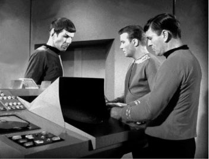

## 7.什么是人
第1章中一些细节的例子是桌子和椅子之类的东西。它们是没有生命的，没有生命的。另一方面，有些细节是动物，例如猫和狗。但人也是特殊的，可以说他们有一些特别之处。人对我们来说非常重要。它们的特殊地位有形而上学的理由吗？他们有思想，有些人认为，灵魂或精神。那么，一个人在时间中持续存在的重要性可能与纯物理对象（如表）持续存在的重要性不同。

我说的一个人，不一定是指一个人。我认识的所有人可能都是人，但至少在概念上似乎存在非人类的可能性。哲学家约翰·洛克（John Locke）看到了这一点（《关于人类理解的论文》，1690年），指出任何具有适当智慧的动物原则上都可以成为人。另一方面，一个人原则上可能没有资格成为一个人。后者将是有争议的，因为从人类身上移除人的地位似乎是我们可以对他们做的最糟糕的事情之一。然而，人们想知道处于持续植物状态的人类是否仍然算人。

那么，什么才能算作一个人呢？洛克提到了智力，更一般地说，我们可能会认为一个人是一个有思想的东西，能够有意识：一个思想和感觉的体验者。他们可能有记忆、信仰、希望和情感。人们也能够采取行动，这使他们成为道德主体，对自己的所作所为负责。如果动物能够做这些事情中的任何一个，或者即使计算机有能力，那么我们可能会认为它们配得上一个人的地位。

### 感谢您的回忆
因为这似乎是造就人的原因，所以有一个非常重要的含义，洛克看到了。虽然我们认为一张桌子会随着时间的流逝而持续存在，因为具有相同的物理部分，但我们并不认为这是对人而言是真的。这里有一些困难的问题。正如我们在第4章中看到的，一种物质确实可以在其某些部分的变化中幸存下来。当您更换汽车发动机中的火花塞时，它仍然是同一辆车。就生物体而言，我们知道身体在不断自我更新：脱落旧的死皮并用新物质取而代之。但在这些情况下，我们用来识别事物并随着时间的推移重新识别它的仍然是物理特征。洛克认为，就人而言，记忆或心理连续性是一个人生存的关键。鉴于我的身体可能从我是一个顽皮的小学生开始就已经多次自我更新，使我和那个顽皮的小学生成为同一个人的原因是我记得自己是他。

然而，我们没有必要将我们的心理局限于记忆。毕竟，我已经忘记了我做过的大部分事情。但我和那个小学生有着同样的信念，有同样的希望，有同样的心理弱点和不安全感。并非一切都一样。那个孩子认为圣诞老人存在，而我没有。但是他和我之间的这种变化是逐渐发生的，一次一点，这意味着通过变化有一些连续性。看来我们必须允许这种灵活性进入帐户。

以下是一种可能性。我不记得自己是那个有一天放学跑回家的小孩（尽管我妈妈经常给我讲这个故事）。但我确实记得自己是那个以优异成绩从哈德斯菲尔德理工学院毕业的人，所以在洛克看来，我和他是一样的。但问题是，我猜想，那个毕业的年轻人当时确实记得是那个从学校跑回家的孩子。所以年轻的毕业生和小孩子是一样的，而我，因为我不记得从学校跑回家，所以不是。然而，我和毕业生是一样的。记忆会随着时间的推移而消失，所以我们需要允许逐渐的变化和连续性。维特根斯坦在这里给了我们一个很好的形象。构成绳索的单股只能穿过它。没有一条线从一端到另一端。但是通过一系列重叠的部分，绳子设法从一端延伸到另一端。我们的心理连续性一定是这样的。

正是我们的思想造就了我们这个样子，这种想法诱使一些人提出了更强烈的主张。笛卡尔认为我们有两个部分：我们的身体和我们的思想（《第一哲学沉思》，1641年）。对我们来说真正至关重要的是思想。我们本质上是在思考事情。有一段时间，我们体现在一个凡人的有机体中，但是，笛卡尔认为，我们有可能在身体的死亡中幸存下来。我们的思想可以在死后继续存在，作为不朽的灵魂。这是一个强烈的形而上学主张，但也许是一个普遍的主张，当然在那些有宗教信仰的人中。除了相信上帝的存在之外，也许它是所有形而上学信仰中最常见的信仰之一，这表明我们中更多的人是形而上学医生，而不是我们想象的。

然而，哲学家总是容易破坏一个好的聚会。他们向许多人投去怀疑和好奇的目光，这是一种令人欣慰的信念。他们试图给那些相信灵魂的人至少两种担忧。首先是算作精神实质的东西。第二個是這樣的靈性物質如何與物質相互作用，就像在一個人的正常時期內身心合一時所應該發生的那樣。

笛卡尔认为物质的本质——他使用“身体”一词——是延伸。这个想法是物质事物 - 物质的物理部分 - 在空间中延伸。它们有尺寸：高度、长度和宽度。人们还可以补充一点，它们在空间中也有一个位置，尽管这可能只是相对于其他物体而言的。然而，扩展是不够的。笛卡尔在这里似乎是错误的，因为一卷空白空间可以有一个扩展。例如，在我的房间中间有一个空地，有一米立方。它是扩展的，但它不是一个物理的东西。我们需要的是占用扩展的空间区域。但是被什么占领了？物理的东西？那就是绕圈子。我们试图说什么是物理的东西。有人提出了一个不可穿透性的概念，或坚固性的概念。物质的本质是延伸的，不可穿透的。据推测，对于气体和液体，我们必须使故事复杂化很多，它们是物理的东西，但不像我们通常认为的那样是固体。但是，让我们从基本思路出发。

相比之下，精神物质不是在空间、位置或不可穿透的。这些都是物理属性。精神物质根本不应该存在于空间中，尽管有些人认为它是在时间中。鬼魂有时在电影中被描绘成半透明的，这表明它们并不是真正的物质。而且它们可以穿过墙壁，所以它们不是不可穿透的。他们甚至应该被描绘成在一个地方吗？对于笛卡尔来说，心灵的本质是思想。一个人的心是一个思考的东西，正是这个思考的东西应该能够继续存在，没有实体。现在思想似乎也不需要空间属性，这使我们能够在没有身体的情况下构想它们。假设你认为今天是星期二，你也想拥有萨尔瓦多·达利的原画。你希望拥有达利的愿望是你相信今天是星期二的左边还是右边？可以说，没有合理的答案，因为信仰不是以地点为特征的。

因此，我们是否生活在一个将精神和肉体作为不同种类的物质包含的世界是一个问题，也是一个典型的形而上学问题。这种二元论受到这样一种观点的挑战，即我们可以只用一种物质来解释一切。唯物主义者认为，所有精神事物都可以还原为物质事物。唯心主义者认为，所有物质事物都可以还原为精神事物。关于一个的一切都可以用另一个来解释，在这些观点上。但假设人们坚持认为两者兼而有之：物质和非物质。然后，我们将面临两者如何相互作用的进一步问题。

### 当精神感动你
很明显，作为物理体现的思考事物，心灵和身体是因果关系的。你在脑海中做出的决定会影响你的身体做什么和它的行为。奔跑公共汽车的决定会让你的腿动起来。回忆起一件尴尬的事情会让你脸红。你的身体发生了什么事会影响你的精神。如果你的身体受伤了，你会感到疼痛。如果你的身体疲倦了，你的思维就会变得困难和不可靠。对你身体感官的物理刺激会导致你的感知。根据二元论者的说法，我们所有的思想、感觉和知觉都在心理范围内。二元论者不必接受身心相互作用，但如果他们否认这一点，他们有一些解释要做。

因此，二元论者必须面对的难题是，如果身心是如此不同，它们如何能够相互影响？上面对精神和身体的描述表明，它们的性质如此不同，以至于它们之间的因果关系看起来是不可能的。当一个物理事物导致另一个物理事物时，例如踢导致球移动时，一个物体会压入另一个物体。有从踢球到球的运动或动量。我们认为因果关系是一个物理过程。但是精神或精神的东西在空间中没有位置，也没有延伸，也没有坚固性。那么，固体运动如何影响他们呢？这样的交易会在哪里进行？有什么可以阻止身体运动直接穿过精神物质，就像那些电影幽灵一样？

這是身心互動的問題，這是一個如此困難的問題，以至於一些二元論者已經準備說，與外表相反，心靈和它的身體畢竟沒有相互作用。另一种回应是说，我们需要一个不同的因果关系概念来解释相互作用。如果我们将因果关系的概念限制在物质因果关系上，那么它当然不适用于精神物质。

然而，有些人认为这个问题是无法克服的。我提到过，一种观点是用身体来解释所有精神事物。也许头脑只不过是大脑的过程。这不一定是将精神完全还原到身体：例如，声称疼痛只是某种类型的大脑过程，或者认为今天是星期二是某种神经元放电模式。心灵的复杂性不太可能用像这些简单类型的物理事件来解释。但物理主义者会说，最终对心灵存在某种这样的解释，即使细节会非常复杂。在这里，我们可以回顾第3章讨论的问题。意识只是以正确方式排列的物理部分的产物，还是有别的东西：涌现的东西？

与其再次进行同样的讨论，不如更多地讨论人，需要讨论。在洛克之后，有人提出，要成为一个合格的人，一个人需要足够复杂的精神生活，能够体验感觉、思考和行动。这最终是否可以在物理上解释不是问题。但我们应该再次考虑这样一种观点，即使一个人现在和过去的人成为同一个人的是心理上的连续性。问题是我们在第1章中遇到的关于数字恒等式的问题。在这种情况下，正是它使一个人在一次成为后来的同一个人。

### 二合一不会去
心理连续性是一个好主意，但它有一个问题，它不一定是一对一的关系，而我们认为身份，包括个人身份，是。我们的意思是，2012年的人最多可以与2002年的一个人相同（如果他们当时出生的话）。同样，2012 年的人最多可以与 2022 年的一个人相同（假设他们活到那时）。对于任何人在任何时候，最多有一个人在任何其他时间与他们相同。

然而，我们看到一个人在某个时间可能与其他时间的一些人有心理连续性。怎么会这样？下面是一个示例。在 1960 年代原版《星际迷航》的旧剧集“内部敌人”中，柯克船长由于运输机机制故障而一分为二。出现的两个“新”柯克人都记得从星际舰队学院毕业。他们都记得他们要求斯科蒂把他们传送出去。不知何故，运输车在每一个细节上都复制了柯克：身体上和心理上。当然，这是科幻小说的内容，但这似乎是一种合乎逻辑的可能性。对哲学家来说，重要的是它可能是真的。在《星际迷航》的故事中，两个柯克其实有点不同。一个得到所有的坏和侵略，另一个得到所有的善良和优柔寡断。但它们同样接近原来的柯克，我们可以想象两个新的柯克是一样的情况。在这一集的最后，两人吵架并争论“我是柯克！“不，我是柯克”，诸如此类。

这使个人身份的心理解释陷入了某种困难。似乎两个新的柯克都和旧的柯克不一样，因为他们有两个，只有一个他。身份是一体的。然而，假设在第一辆像以前一样回来之后，斯科蒂已经看到故障运输车正在制造另一辆。意识到拥有两个柯克意味着原来的柯克实际上不再是，斯科蒂决定在组装柯克的过程完成之前摧毁二号柯克。

在第二个故事中，似乎后运输车柯克与原始柯克相同。他与原著有足够的心理连续性，只有一个他。他没有其他人可以与他竞争柯克的身份。然而，为什么其他人是否在身边如此重要？我们是否可以认为身份应该是有关个人固有的问题？它真的应该取决于其他人是否存在吗？我很确定我和那个毕业的年轻人是一样的。然而，我不能排除昨晚我的卧室被一位疯狂的科学家入侵的可能性，他用一个完整的大脑和身体扫描仪，今天早上在其他地方创造了我的复制品。鉴于我不确定这样的副本是否被保存在其他地方，那么我无法确定我是否真的与1989年的哈德斯菲尔德毕业生相同。

图8. 这台机器可以把你一分为二吗？

### 都在脑海里？
到目前为止，我一直愿意按照洛克的最初想法，认为心理连续性是关键。但是我们真的能相信这个账户吗？如果疯狂的科学家去创造你的复制品，即使复制品完全复制了你的思想，你还能声称自己是原始的吗？这是你可以争论它的方式。你是真实的你，因为你是原始的有机体。除了与原作的心理连续性外，您还可以指出身体的连续性。你醒来时躺在昨晚睡觉的同一张床上，你没有把它留在中间。在你现在和过去的你之间有一条连续的空间和时间线。与冒名顶替者没有这样的界限。他是在城镇另一边的一个破旧的实验室里创造的，离你躺着的地方超过5英里。可怜的灵魂可能认为他是你，但他不是。可怜他或她。

这是支持这种观点的另一个考虑因素。假设一位美国历史学家阅读了关于肯尼迪的所有内容。也许他会成为世界领先的专家。但他在学术生涯中如此努力，以至于精神完全崩溃。他开始相信自己是肯尼迪，1963年<>月开始昏迷后才刚刚醒来。因为他对肯尼迪的生活了解很多，所以他可以告诉你“他”所做的一切。他以第一人称视角告诉你这一切。在他的错觉中，他记得在猪湾灾难和古巴导弹危机期间担任总统。

这说明洛克对个人身份的记忆标准是不充分的。我们可以区分真实的记忆和虚假的记忆，而虚假的记忆在某种程度上是虚幻的。在某些情况下，人们听到故事很多次，他们开始相信他们亲眼目睹了这些故事，而实际上并非如此。所谓的记忆是不够的。

假设第一人称证词不足以使记忆真实——或者可能不足以让它算作记忆，而不仅仅是伪记忆——我们必须有其他一些基础来区分真实和虚幻的记忆。还有什么比身体在空间和时间上的物理连续性更好的标准呢？我们的历史学家不是肯尼迪，因为他与肯尼迪没有身体上的连续性。肯尼迪的遗体仍躺在弗吉尼亚州的阿灵顿公墓。这位历史学家甚至从未去过阿灵顿。事实上，当肯尼迪在达拉斯被杀时，我们的历史学家还是纽约的一个小男孩，等等。

如果我们想到个人身份的身体标准，它可以将我们从已经提出的一些问题案例中解放出来。但不是全部。在《星际迷航》的传送案例中，两个柯克可能与最初的柯克在身体和精神、心理上的连续性相同。原则上，一个人似乎是分裂的，像变形虫一样，身体和灵魂。也许我们不得不承认，在这种情况下，身份就失去了。

那么，一个人是什么呢？你的答案首先取决于你是否认为我们是灵魂。如果我们与身体有着千丝万缕的联系，那么心理和生理因素似乎对于使我们在任何时候以及随着时间的推移都成为现在的样子至关重要。但这种连续性可能不足以在每种情况下都确定个人身份。